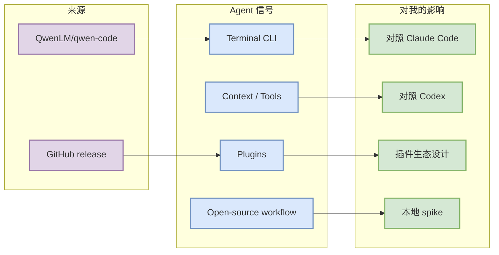

# QwenLM/qwen-code

> 一句话结论：Qwen Code 是开源 terminal coding-agent watched repo；今日在 Loop Engineer 增长榜中出现，但 Daily 链接落在 AIInfra 路径，因此创建本 alias/detail 以保证 wikilink 完整。

## TL;DR

- Repo：[QwenLM/qwen-code](https://github.com/QwenLM/qwen-code)
- 来源类型：GitHub direct watched repo / GitHub Release
- 关注点：CLI agent、插件、上下文、权限、开源 coding workflow
- 可信度：direct `/repos` + release API；Search API 今日 403，增长为 watched-repo fallback。

## 专业解读

Qwen Code 的价值主要不在单个 release tag，而在开源 coding-agent loop 的可观察性：可以对照 Claude Code、OpenAI Codex、Gemini CLI 的权限模型、插件接口、CLI/TUI 体验和上下文组织方式。

## 我应该如何跟进

1. 查看最新 release 与 README。
2. 对照 Claude Code/Codex 的 sandbox、approval、tool-call 机制。
3. 若插件协议有更新，抽取为本地 agent harness 的设计参考。

## 相关链接

- 原文：https://github.com/QwenLM/qwen-code
- Daily：[[Daily/2026-08-14]]

#ai-radar #github #loop-engineering #coding-agent
