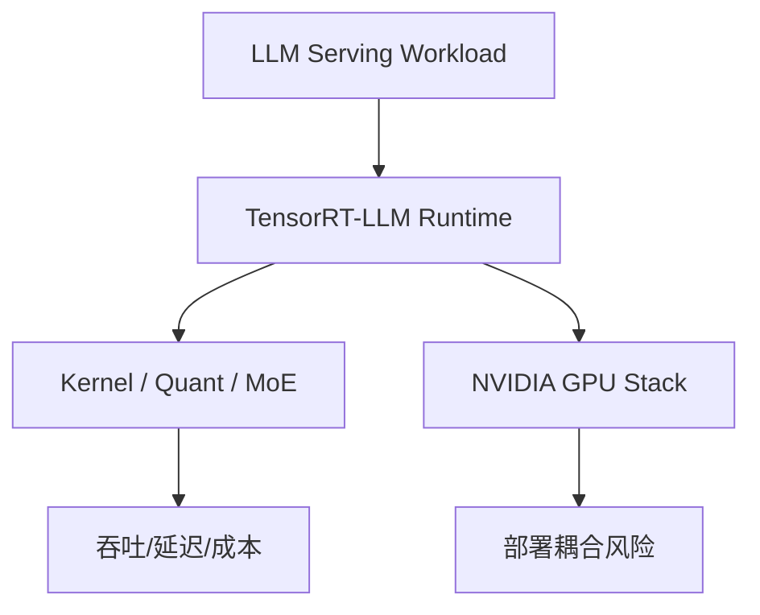

# NVIDIA/TensorRT-LLM

> 日期：2026-08-15
> 来源类型：GitHub repository / direct watched-repo fallback
> 原文：https://github.com/NVIDIA/TensorRT-LLM

## 一句话结论
NVIDIA/TensorRT-LLM 是 NVIDIA LLM serving 优化栈的固定观察对象，适合继续跟踪 Blackwell、MoE、kernel、quantization 与 inference runtime 变化。

## TL;DR
- 用途：LLM inference / serving 优化。
- 今日状态：GitHub Search 403，因此作为 direct watched-repo fallback 详情页补齐。
- 对我影响：可对照 vLLM/SGLang 的 scheduler、KV cache、GPU kernel 与部署复杂度。

## 信息压缩图示

## 影响矩阵
| 维度 | 判断 |
|---|---|
| AI Infra | 高 |
| Serving | 高 |
| 风险 | NVIDIA stack 绑定，需实测 |

## 相关链接
- Daily：[[Daily/2026-08-15]]
- 原文：https://github.com/NVIDIA/TensorRT-LLM

#ai-radar #github #ai-infra
