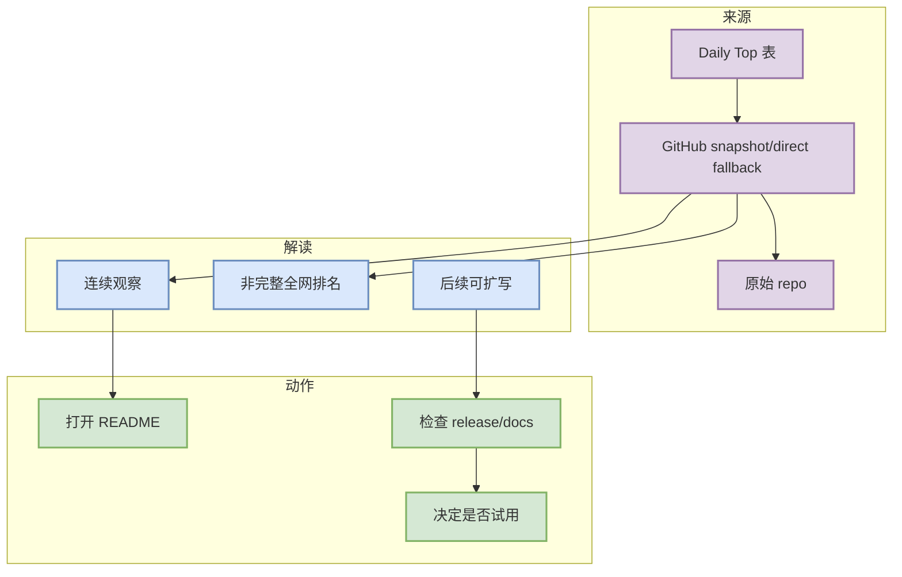

# vllm-project/vllm

> 类型：GitHub / Alias Detail
> 大类：GitHub
> 小类：AI Radar link completion
> 推荐等级：可 skim
> 创建日期：2026-08-16
> 原文链接：https://github.com/vllm-project/vllm
> 网页详情：https://github.com/dyt27666-oss/AI-news-report-obsidians/blob/main/GitHub/AIInfra/2026-08-16/vllm-project__vllm.md
> 返回日报：[[Daily/2026-08-16]]

## 一句话结论
这是为保证 Daily wikilink 可点击而补齐的详情页；若该条目属于 direct watched fallback，则其增长不代表完整全网排名。

## TL;DR
- **它是什么**：A high-throughput and memory-efficient inference and serving engine for LLMs
- **为什么重要**：该条目出现在今日固定 Top 10 / Loop Engineer / Point Rummy 表中，需要有可点击详情页承接日报导航。
- **和我相关的点**：stars=89140，forks=20735，language=Python，updated_at=2026-08-16T00:44:23Z。
- **建议动作**：先作为索引页；若后续连续增长或发布重要 release，再扩写为深度页。

## 元信息
| 字段 | 内容 |
|---|---|
| repo | vllm-project/vllm |
| stars / forks | 89140 / 20735 |
| language | Python |
| updated_at | 2026-08-16T00:44:23Z |
| topics | amd, blackwell, cuda, deepseek, deepseek-v3, gpt, gpt-oss, inference, kimi, llama, llm, llm-serving, model-serving, moe, openai, pytorch, qwen, qwen3, tpu, transformer |
| 增长依据 | direct watched repo fallback vs 2026-08-15 snapshot，非完整全网日增 |
| 原文 | [GitHub](https://github.com/vllm-project/vllm) |

## 信息压缩图示

### 影响矩阵
| 维度 | 影响 | 建议动作 |
|---|---|---|
| AI Infra | 若为 serving/training/runtime 项目，适合观察选型 | 看 docs/benchmark |
| Agent Loop | 若为 coding tool/agent repo，适合跟踪权限与工具调用 | 看 release |
| Point Rummy | 若为 Rummy repo，适合抽取规则/计分/bot schema | 读 README/代码 |
| 可信度 | 今日部分数据来自 fallback | 不过度解读 delta |

## 可信度与局限性
- 这是 link hygiene 补齐页，深度低于手写详情。
- GitHub Search 今日 403，部分 broad/loop 表为 direct watched fallback。
- 后续若该条目成为必读，应扩写机制、benchmark、试用记录。

## 相关链接
- 原文：https://github.com/vllm-project/vllm
- 网页详情：https://github.com/dyt27666-oss/AI-news-report-obsidians/blob/main/GitHub/AIInfra/2026-08-16/vllm-project__vllm.md

## 标签
#ai-radar #github #link-hygiene
