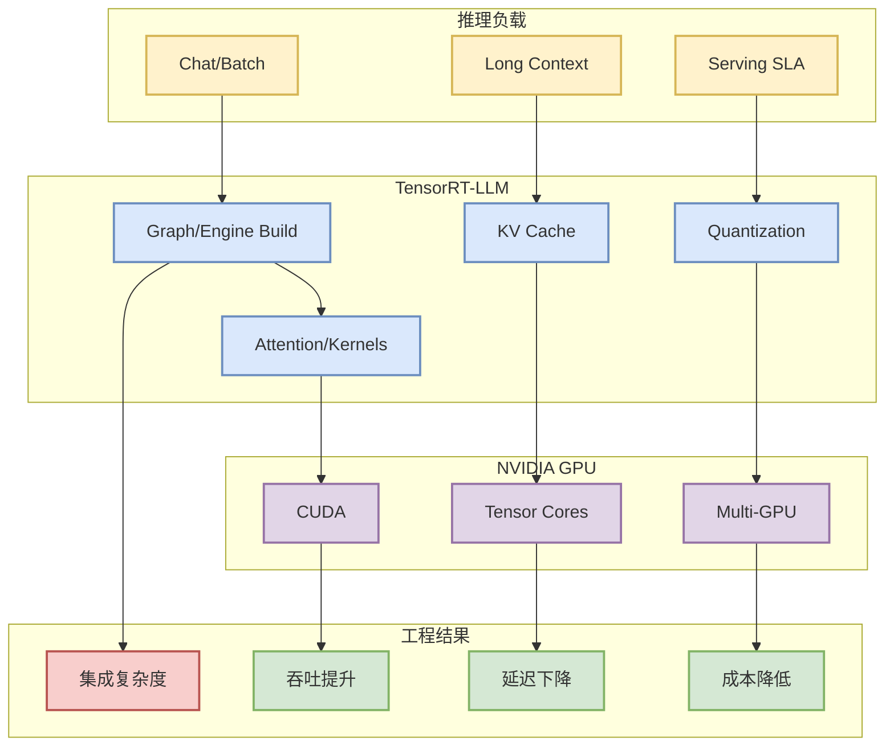

# NVIDIA/TensorRT-LLM

> 类型：GitHub
> 大类：AI Infra
> 小类：NVIDIA LLM Inference Runtime
> 推荐等级：必读
> 创建日期：2026-08-21
> 原文链接：https://github.com/NVIDIA/TensorRT-LLM
> 网页详情：https://github.com/dyt27666-oss/AI-news-report-obsidians/blob/main/GitHub/AIInfra/2026-08-21/NVIDIA__TensorRT-LLM.md
> 返回日报：[[Daily/2026-08-21]]

## 一句话结论

TensorRT-LLM 是 NVIDIA GPU 上 LLM inference runtime 的核心观察源，直接关系到吞吐、延迟、kernel 优化和部署成本。

## TL;DR

- **它是什么**：NVIDIA 官方/生态 LLM inference runtime。
- **为什么重要**：硬件、kernel、runtime 优化会迅速传导到生产 serving 成本。
- **和我相关的点**：KV cache、attention kernel、quantization、batching、GPU 部署。
- **建议动作**：作为 vLLM/SGLang 对照组，持续看 release 和 benchmark。

## 元信息

| 字段 | 内容 |
|---|---|
| 发布方/来源 | NVIDIA |
| 来源类型 | GitHub repo / AI Infra |
| 原文 | [GitHub](https://github.com/NVIDIA/TensorRT-LLM) |
| 代码 | https://github.com/NVIDIA/TensorRT-LLM |
| 标签 | #ai-radar #nvidia #serving |

## 信息压缩图示

### 影响矩阵

| 维度 | 影响 | 建议动作 |
|---|---|---|
| AI Infra | 生产推理成本 | 按硬件栈做 benchmark |
| LLM 工程 | 模型部署/quantization | 验证模型支持 |
| RL / Game AI | rollout 推理成本 | 用小模型批量 rollout 测试 |
| Agent / Eval | 低延迟 agent serving | 评估部署复杂度 |

## 专业解读

TensorRT-LLM 的重点是把通用模型推理压到硬件友好的 runtime/engine 上。对生产系统，收益通常来自 kernel、graph、quantization 和多 GPU 支持；风险来自构建复杂度、模型兼容性和调试成本。

## 通俗解释

它像 NVIDIA GPU 的“专用模型加速器软件层”，可能让同样硬件跑更多请求。

## 关键机制拆解

| 机制 | 解决的问题 | 为什么有效 | 可能的坑 |
|---|---|---|---|
| Engine build | 通用计算图低效 | 编译优化 | 构建链复杂 |
| Attention kernel | 长上下文成本 | 硬件友好实现 | 版本兼容 |
| Quantization | 显存/吞吐 | 降低计算和存储 | 质量损失需评估 |

## 对我的影响

适合作为 NVIDIA GPU serving 方案对照，和 vLLM/SGLang 一起进入定期 benchmark。

## 可信度与局限性

今日为 direct watched fallback 详情页，未进行源码审计。

## 我应该如何跟进

1. 查看最新 release 与支持模型。
2. 用内部 workload 比较吞吐/延迟/成本。
3. 记录部署复杂度和维护风险。

## 相关链接

- 原文：https://github.com/NVIDIA/TensorRT-LLM
- 返回日报：[[Daily/2026-08-21]]

#ai-radar #github #nvidia #serving
