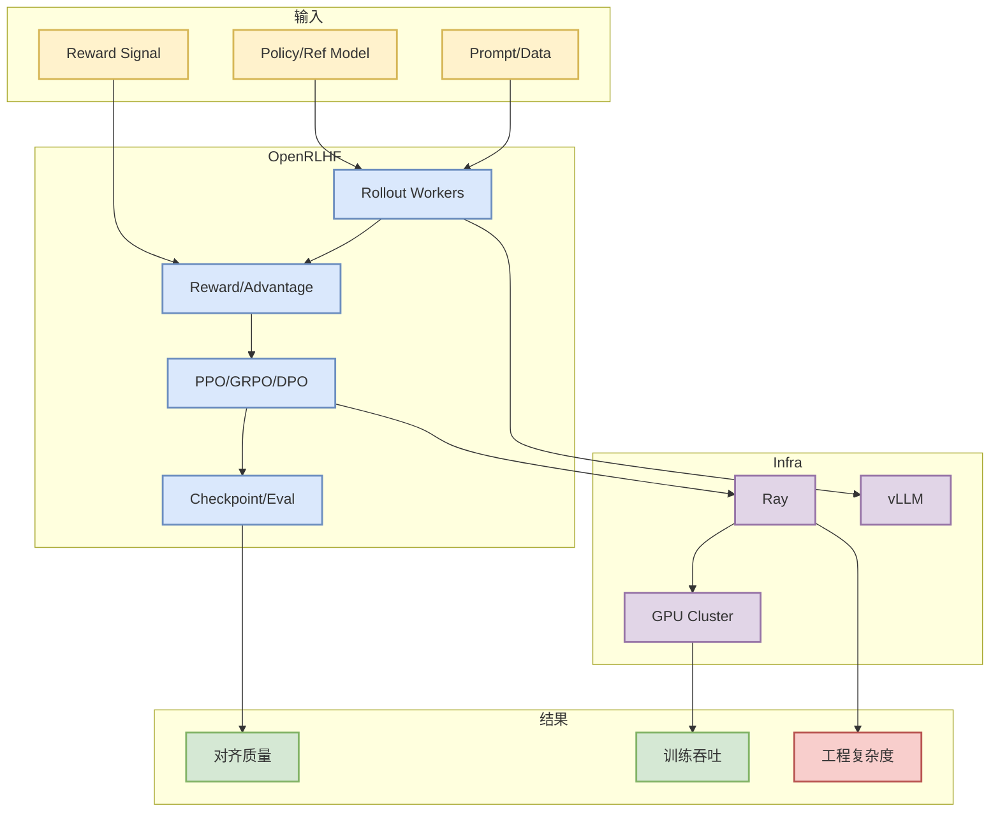

# OpenRLHF/OpenRLHF

> 类型：GitHub
> 大类：AI Infra
> 小类：RLHF / Agentic RL
> 推荐等级：可 skim
> 创建日期：2026-08-21
> 原文链接：https://github.com/OpenRLHF/OpenRLHF
> 网页详情：https://github.com/dyt27666-oss/AI-news-report-obsidians/blob/main/GitHub/AIInfra/2026-08-21/OpenRLHF__OpenRLHF.md
> 返回日报：[[Daily/2026-08-21]]

## 一句话结论

OpenRLHF 是 Ray + vLLM 风格 RLHF/agentic RL 工程框架的重要 baseline，可用于对比 PPO/GRPO/DPO 等 post-training 管线。

## TL;DR

- **它是什么**：开源 RLHF / post-training 框架。
- **为什么重要**：连接分布式训练、rollout serving、reward model 与 policy update。
- **和我相关的点**：LLM post-training、RL 游戏模型训练和 agentic RL 的工程化。
- **建议动作**：对比 verl，看 API、稳定性、算法覆盖和硬件成本。

## 元信息

| 字段 | 内容 |
|---|---|
| Repo | [OpenRLHF/OpenRLHF](https://github.com/OpenRLHF/OpenRLHF) |
| 来源类型 | GitHub repo / RLHF framework |
| 原文 | [GitHub](https://github.com/OpenRLHF/OpenRLHF) |
| 代码 | https://github.com/OpenRLHF/OpenRLHF |
| 标签 | #ai-radar #rlhf |

## 信息压缩图示

### 影响矩阵

| 维度 | 影响 | 建议动作 |
|---|---|---|
| AI Infra | 分布式 RLHF 成本 | 对比资源占用 |
| LLM 工程 | 对齐/后训练 pipeline | 跑小模型 example |
| RL / Game AI | reward/rollout 架构 | 借鉴 self-play 管线 |
| Agent / Eval | 长任务优化 | 关注 agentic RL 支持 |

## 专业解读

OpenRLHF 对用户的主要价值是提供可参照的工程边界：rollout 怎么扩展、reward 怎么接、policy update 怎么调度，以及 vLLM/Ray 这类依赖如何影响训练成本。

## 通俗解释

它是做 RLHF 的工具箱，把“让模型尝试、评分、改进”的循环串起来。

## 关键机制拆解

| 机制 | 解决的问题 | 为什么有效 | 可能的坑 |
|---|---|---|---|
| Ray workers | 并行训练/rollout | 横向扩展 | 集群调试复杂 |
| vLLM rollout | 生成样本成本 | 高吞吐 serving | 版本兼容 |
| Reward pipeline | 训练信号 | 可插拔目标 | reward hacking |

## 对我的影响

适合与 verl 一起作为 post-training/RLHF 工程 baseline，后续可映射到 Rummy/Game AI self-play。

## 可信度与局限性

今日为 direct watched fallback 详情页；需要后续验证最新 release 与文档。

## 我应该如何跟进

1. 跑小模型 RLHF example。
2. 对比 verl 的接口和资源成本。
3. 记录 reward/eval 接口是否适合游戏环境。

## 相关链接

- 原文：https://github.com/OpenRLHF/OpenRLHF
- 返回日报：[[Daily/2026-08-21]]

#ai-radar #github #rlhf #post-training
