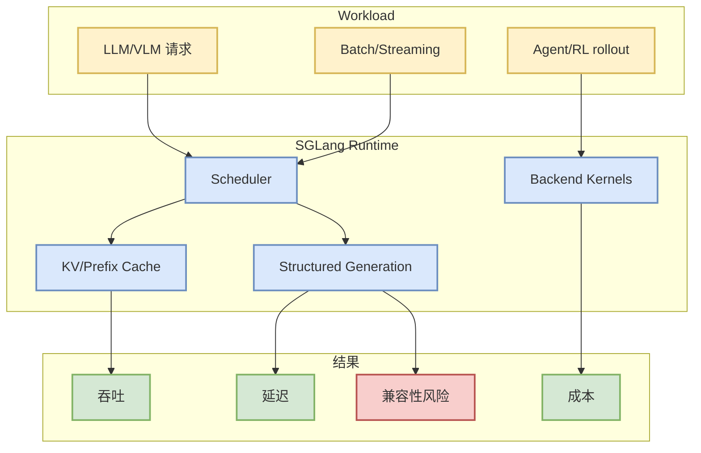

# sgl-project/sglang

> 类型：GitHub
> 大类：AI Infra
> 小类：LLM Serving / Runtime
> 推荐等级：可 skim
> 创建日期：2026-08-21
> 原文链接：https://github.com/sgl-project/sglang
> 网页详情：https://github.com/dyt27666-oss/AI-news-report-obsidians/blob/main/GitHub/AIInfra/2026-08-21/sgl-project__sglang.md
> 返回日报：[[Daily/2026-08-21]]

## 一句话结论

SGLang 是 LLM/VLM serving runtime 固定观察项，适合跟踪并发、结构化生成、scheduler、KV cache 与 RL serving 相关优化。

## TL;DR

- **它是什么**：高性能 LLM/VLM serving 框架。
- **为什么重要**：与 vLLM、TensorRT-LLM 一起构成推理系统核心选型池。
- **和我相关的点**：影响吞吐、延迟、GPU 利用率和 agent/RL rollout serving。
- **建议动作**：关注 release、benchmark、兼容模型和生产部署案例。

## 元信息

| 字段 | 内容 |
|---|---|
| Repo | [sgl-project/sglang](https://github.com/sgl-project/sglang) |
| 来源类型 | GitHub repo / direct watched fallback |
| 发布时间 | 2026-08-21 snapshot |
| 原文 | [GitHub](https://github.com/sgl-project/sglang) |
| 代码 | https://github.com/sgl-project/sglang |
| 标签 | #ai-radar #serving |

## 信息压缩图示

### 影响矩阵

| 维度 | 影响 | 建议动作 |
|---|---|---|
| AI Infra | Serving runtime 选型 | 对比 vLLM/TRT-LLM benchmark |
| LLM 工程 | 结构化生成与并发推理 | 看模型兼容性 |
| RL / Game AI | rollout serving 成本 | 小规模压测 |
| Agent / Eval | 工具链低延迟调用 | 加入观察 |

## 专业解读

SGLang 的价值在于把模型调用从普通 API 抽象推进到可优化的 serving/runtime 层。对 AI Infra 工程师来说，重点不是 star，而是它能否在实际 workload 上减少尾延迟、提升吞吐并稳定支持多模型/多模态请求。

## 通俗解释

它像模型服务的高性能发动机，决定模型在大量请求下跑得快不快、稳不稳。

## 关键机制拆解

| 机制 | 解决的问题 | 为什么有效 | 可能的坑 |
|---|---|---|---|
| Scheduler | 并发请求调度 | 提高 GPU 利用率 | workload 差异大 |
| KV/Prefix Cache | 重复上下文成本 | 降低延迟和显存压力 | 缓存策略复杂 |
| Structured Generation | agent 输出约束 | 提升可靠性 | 兼容性需测试 |

## 对我的影响

应作为 serving spike 的固定候选，和 vLLM、TensorRT-LLM 做同 workload 对比。

## 可信度与局限性

今日页面来自 direct watched fallback，不代表完整全网增长排名；需要后续看 release 和 benchmark。

## 我应该如何跟进

1. 看最新 release / README benchmark。
2. 选一个内部 serving workload 做 30 分钟 spike。
3. 记录与 vLLM/TRT-LLM 的差异。

## 相关链接

- 原文：https://github.com/sgl-project/sglang
- 返回日报：[[Daily/2026-08-21]]

#ai-radar #github #ai-infra #serving
