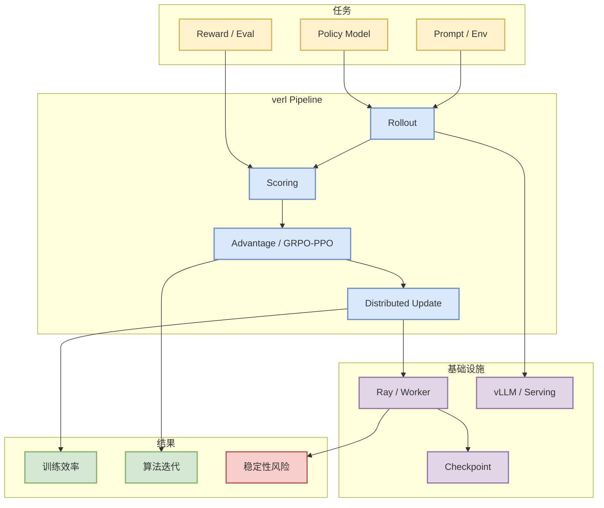

# verl-project/verl

> 类型：GitHub
> 大类：AI Infra
> 小类：RLHF / Post-training
> 推荐等级：可 skim
> 创建日期：2026-08-21
> 原文链接：https://github.com/verl-project/verl
> 网页详情：https://github.com/dyt27666-oss/AI-news-report-obsidians/blob/main/GitHub/AIInfra/2026-08-21/verl-project__verl.md
> 返回日报：[[Daily/2026-08-21]]

## 一句话结论

verl 是 RL post-training / HybridFlow 训练管线的重要观察项，适合跟踪 GRPO/PPO/RLHF、rollout、reward 与分布式训练编排。

## TL;DR

- **它是什么**：面向大模型 post-training 的 RLHF/agentic RL 框架。
- **为什么重要**：把 rollout、reward、policy update、分布式执行连接成工程管线。
- **和我相关的点**：RL 游戏模型训练、LLM post-training、评测和 serving 交互。
- **建议动作**：关注 examples、算法支持、vLLM/Ray 集成和稳定性。

## 元信息

| 字段 | 内容 |
|---|---|
| Repo | [verl-project/verl](https://github.com/verl-project/verl) |
| 来源类型 | GitHub repo / RL post-training |
| 原文 | [GitHub](https://github.com/verl-project/verl) |
| 代码 | https://github.com/verl-project/verl |
| 标签 | #ai-radar #rlhf #post-training |

## 信息压缩图示

### 影响矩阵

| 维度 | 影响 | 建议动作 |
|---|---|---|
| AI Infra | 分布式 rollout/update | 看 Ray/vLLM 集成 |
| LLM 工程 | post-training 实验速度 | 跑官方 example |
| RL / Game AI | reward/env/evaluator 管线 | 映射到 Rummy self-play |
| Agent / Eval | agentic RL 反馈闭环 | 关注长任务 reward |

## 专业解读

verl 的价值在于把算法论文里的 RLHF/GRPO/PPO 变成可运行管线。它对用户的价值尤其在于 rollout、reward、训练更新和 serving 的边界设计，可迁移到 game AI 或 agentic RL。

## 通俗解释

它像大模型后训练的“流水线工厂”：让模型做题、打分、更新，再不断循环。

## 关键机制拆解

| 机制 | 解决的问题 | 为什么有效 | 可能的坑 |
|---|---|---|---|
| Rollout | 样本生成成本 | 并行生成 | serving 稳定性 |
| Reward/Eval | 优化目标 | 可插拔评分 | reward hacking |
| Distributed Update | 大模型训练成本 | 分布式扩展 | 调试复杂 |

## 对我的影响

适合作为 RLHF/GRPO 和游戏 RL 环境自训练的工程参考。

## 可信度与局限性

今日为 direct watched fallback 详情页；具体算法支持和稳定性需看最新 docs。

## 我应该如何跟进

1. 跑一个最小 GRPO/PPO example。
2. 记录 reward/evaluator 接口。
3. 评估是否能接 Rummy environment。

## 相关链接

- 原文：https://github.com/verl-project/verl
- 返回日报：[[Daily/2026-08-21]]

#ai-radar #github #rlhf #post-training
