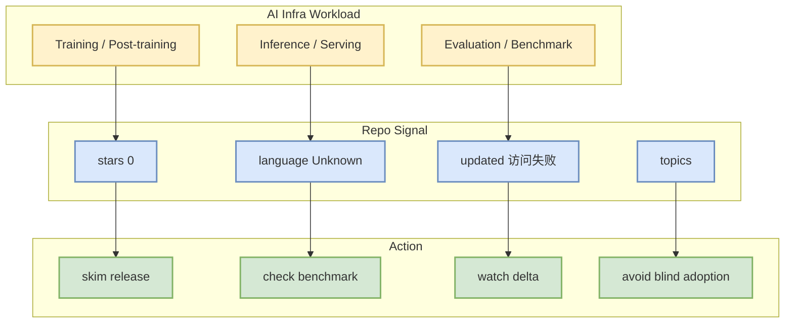

# NVIDIA/TensorRT-LLM

> 日期：2026-08-22  
> 来源类型：GitHub repository / direct watched fallback  
> 原文：[NVIDIA/TensorRT-LLM](https://github.com/NVIDIA/TensorRT-LLM)

## 一句话结论
direct GET failed: HTTP Error 403: rate limit exceeded。本页用于补齐今日日报索引中的 AI Infra 详情链接。

## TL;DR
- stars/forks：0 / 0；语言：Unknown。
- 最近更新：访问失败；topics：无。
- 对用户价值：观察 LLM serving、RL post-training、分布式训练或 GPU runtime 的工程变化。

## 信息压缩图示

## 影响矩阵
| 维度 | 观察 | 跟进 |
|---|---|---|
| Serving/Training | direct GET failed: HTTP Error 403: rate limit exceeded | 查 release / benchmark / issues |
| 工程成熟度 | stars/forks/更新时间 | 作为 watchlist，不直接生产依赖 |
| 可信度 | Direct GitHub API 元数据 | 明日继续比较 stars_delta |

## 相关链接
- 原文：https://github.com/NVIDIA/TensorRT-LLM
- 今日日报：[[Daily/2026-08-22]]

#ai-radar #github #ai-infra
