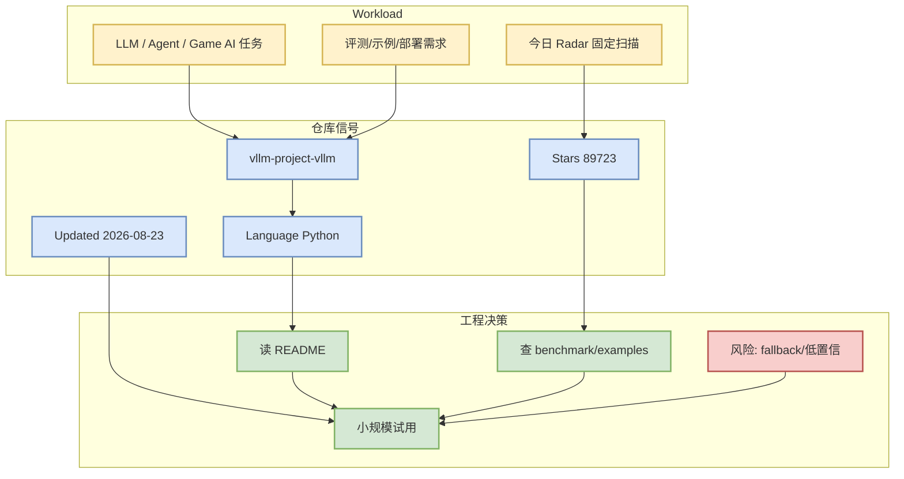

# vllm-project/vllm

> 类型：GitHub 项目详情  
> 推荐等级：可 skim  
> 创建日期：2026-08-23  
> 原文链接：https://github.com/vllm-project/vllm  
> 返回日报：[[Daily/2026-08-23]]

## 一句话结论
vllm-project/vllm 是今日固定 GitHub 扫描中的 AI Infra / coding-agent watched repo fallback，当前 stars=89723，需要结合源码活跃度与 benchmark 决定是否试用。

## TL;DR
- **它是什么**：A high-throughput and memory-efficient inference and serving engine for LLMs
- **为什么重要**：对用户关注的 serving/training/agent loop/RL game AI，可作为实现参考或观察对象。
- **和我相关的点**：stars_delta=63；增长依据=direct watched repo fallback / 非完整全网日增。
- **建议动作**：先读 README/examples，再看 issues/releases 是否支撑生产试用。

## 元信息
| 字段 | 内容 |
|---|---|
| repo | vllm-project/vllm |
| stars / forks | 89723 / 21060 |
| language | Python |
| updated_at | 2026-08-23T01:00:47Z |
| topics | amd, blackwell, cuda, deepseek, deepseek-v3, gpt, gpt-oss, inference, kimi, llama, llm, llm-serving, model-serving, moe, openai, pytorch, qwen, qwen3, tpu, transformer |
| 原文 | [GitHub](https://github.com/vllm-project/vllm) |
| 来源类型 | GitHub Repository / direct watched repo fallback / 非完整全网日增 |

## 信息压缩图示

## 影响矩阵
| 维度 | 影响 | 建议动作 |
|---|---|---|
| AI Infra | 可参考架构、调度、部署或 benchmark 设计 | clone 后先跑最小 example |
| LLM 工程 | 若涉及 serving / agent，可纳入工具链观察 | 关注 release 与文档完整度 |
| RL / Game AI | 若为牌类或仿真 repo，可用于规则/环境拆解 | 提取规则引擎与 evaluator |
| Agent / Eval | 若为 coding-agent loop，可观察 context/harness/eval loop | 对照 Hermes skills/AGENTS.md 流程 |

## 可信度与局限性
- 证据强度：GitHub API 元数据；Search 今日出现 403，因此 broad/Loop 表明确标注 direct watched repo fallback。
- 局限性：未完整阅读源码，stars_delta 不是全网完整日增。
- 还需要确认：README、license、examples、benchmark、release cadence。

## 相关链接
- 原文：https://github.com/vllm-project/vllm
- 网页详情：https://github.com/dyt27666-oss/AI-news-report-obsidians/blob/main/GitHub/AIInfra/2026-08-23/vllm-project-vllm.md

#ai-radar #github #ai-infra
