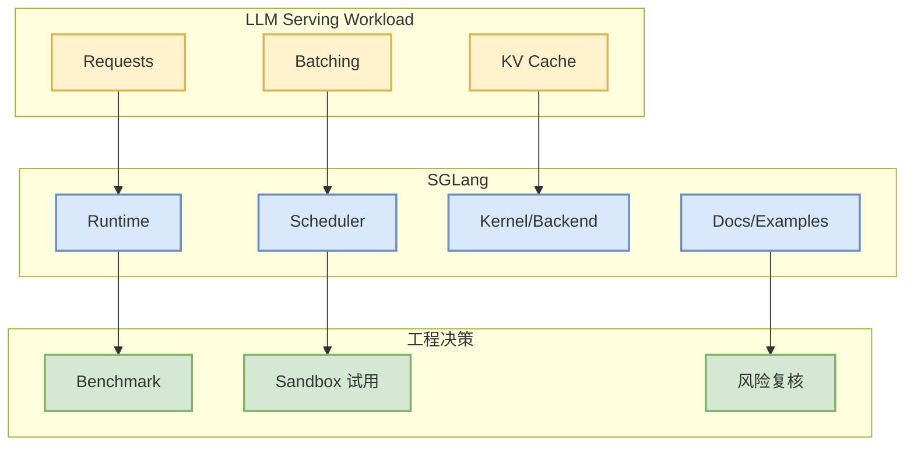

# sgl-project/sglang - 2026-08-24

> 一句话结论：sgl-project/sglang 是 AI Infra direct watched fallback 中的关键 serving / inference 观察点。

## TL;DR
- 来源：GitHub direct watched repo fallback
- 原文：https://github.com/sgl-project/sglang
- 今日状态：GitHub Search 403 后保留 watched-set 详情页，用于 link hygiene 与后续 star delta 对比。

## 信息压缩图示

## 影响矩阵
| 维度 | 判断 | 下一步 |
|---|---|---|
| Serving / Inference | 高相关 | 复核 README、benchmark、release |
| 可信度 | 中 | 今日为 direct fallback，非完整全网榜单 |
| 落地性 | 中高 | 放入最小 workload sandbox |

## 相关链接
- 原文：https://github.com/sgl-project/sglang
- 今日日报：[[Daily/2026-08-24]]

#ai-radar #github #ai-infra
