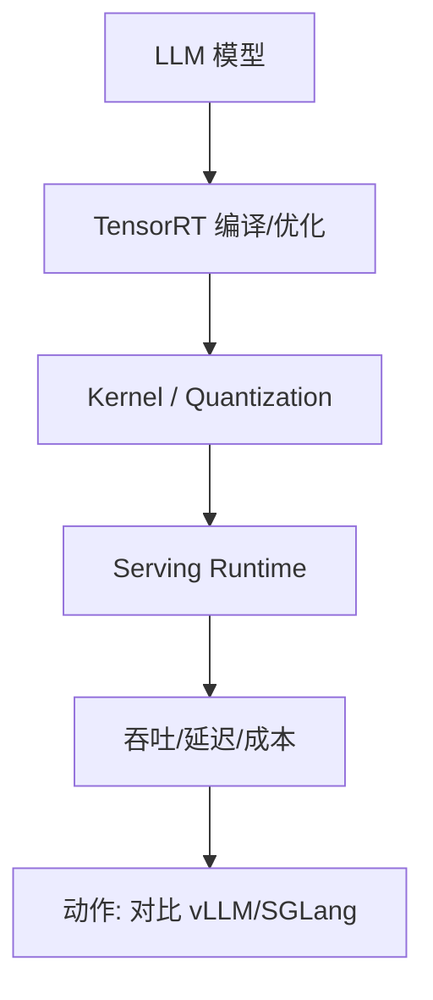
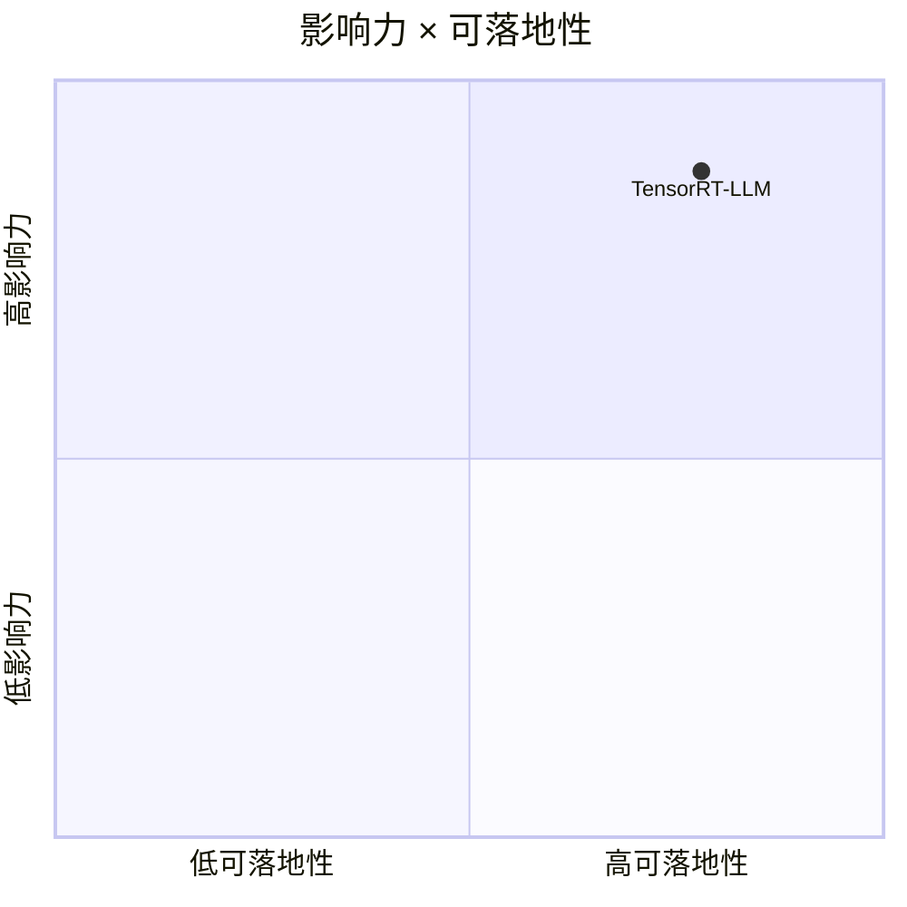

# NVIDIA/TensorRT-LLM

> 类型：GitHub 项目
> 创建日期：2026-08-26
> 原文链接：https://github.com/NVIDIA/TensorRT-LLM
> 返回日报：[[Daily/2026-08-26]]

## 一句话结论

TensorRT-LLM 是 NVIDIA GPU 推理优化栈的关键观察对象。

## 信息压缩图示

## 对我的影响

适合跟踪 GPU 推理性能、低延迟部署、kernel 优化和生产 serving 方案选择。

#ai-radar #nvidia #serving
