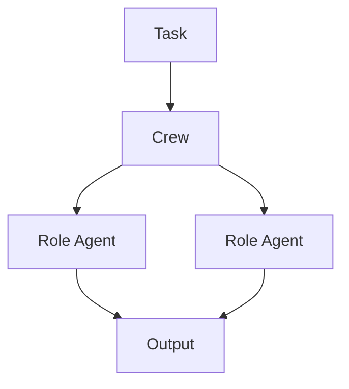
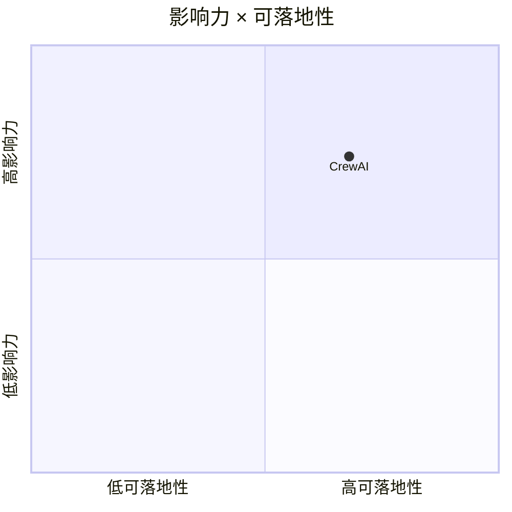

# crewAIInc/crewAI

> 类型：GitHub 项目
> 创建日期：2026-08-26
> 原文链接：https://github.com/crewAIInc/crewAI
> 返回日报：[[Daily/2026-08-26]]

## 一句话结论

CrewAI 是多角色自主 agent 编排框架，可作为 Loop Engineer 参考。

#ai-radar #agents #crewai
