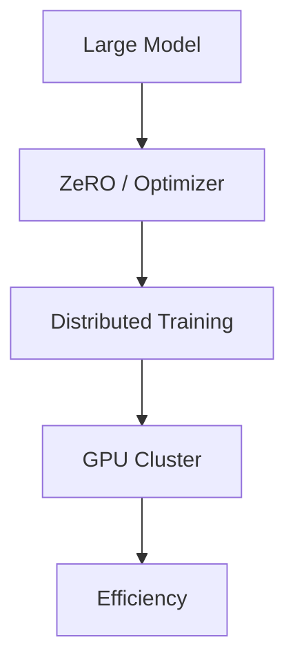
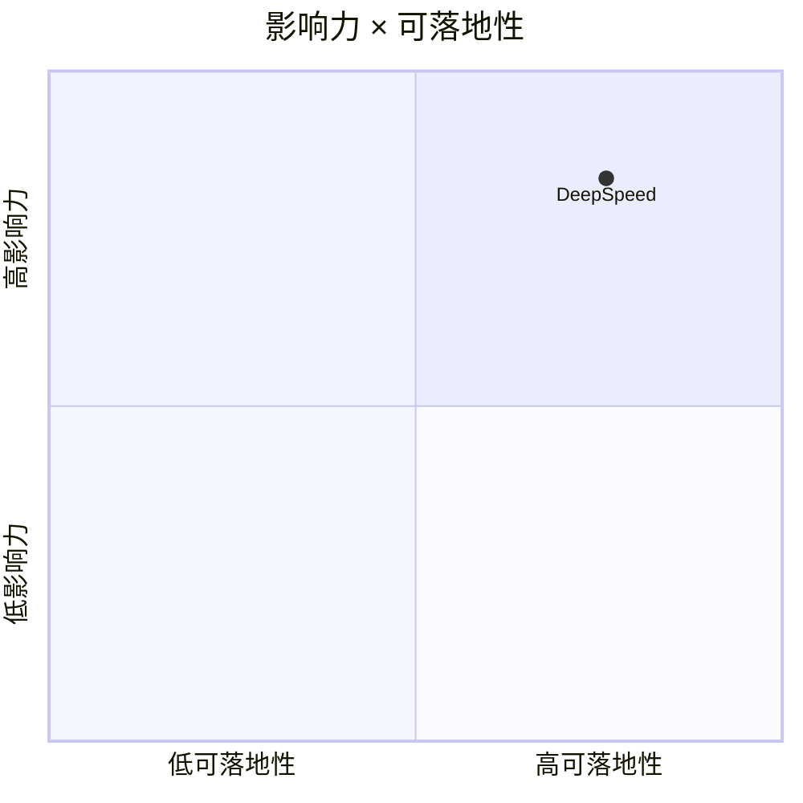

# microsoft/DeepSpeed

> 类型：GitHub 项目
> 创建日期：2026-08-26
> 原文链接：https://github.com/microsoft/DeepSpeed
> 返回日报：[[Daily/2026-08-26]]

## 一句话结论

DeepSpeed 是分布式训练和优化的重要基础设施项目。

#ai-radar #training #deepspeed
