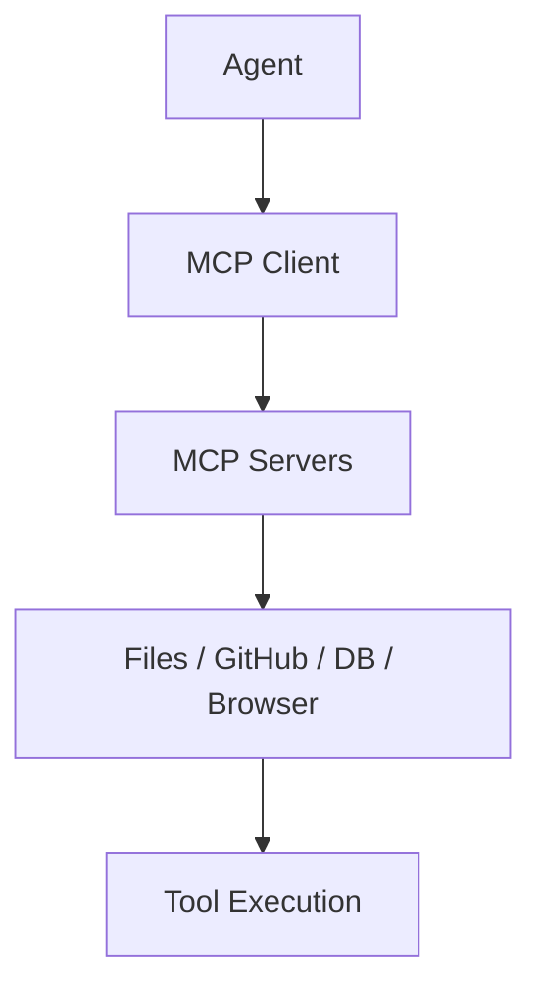
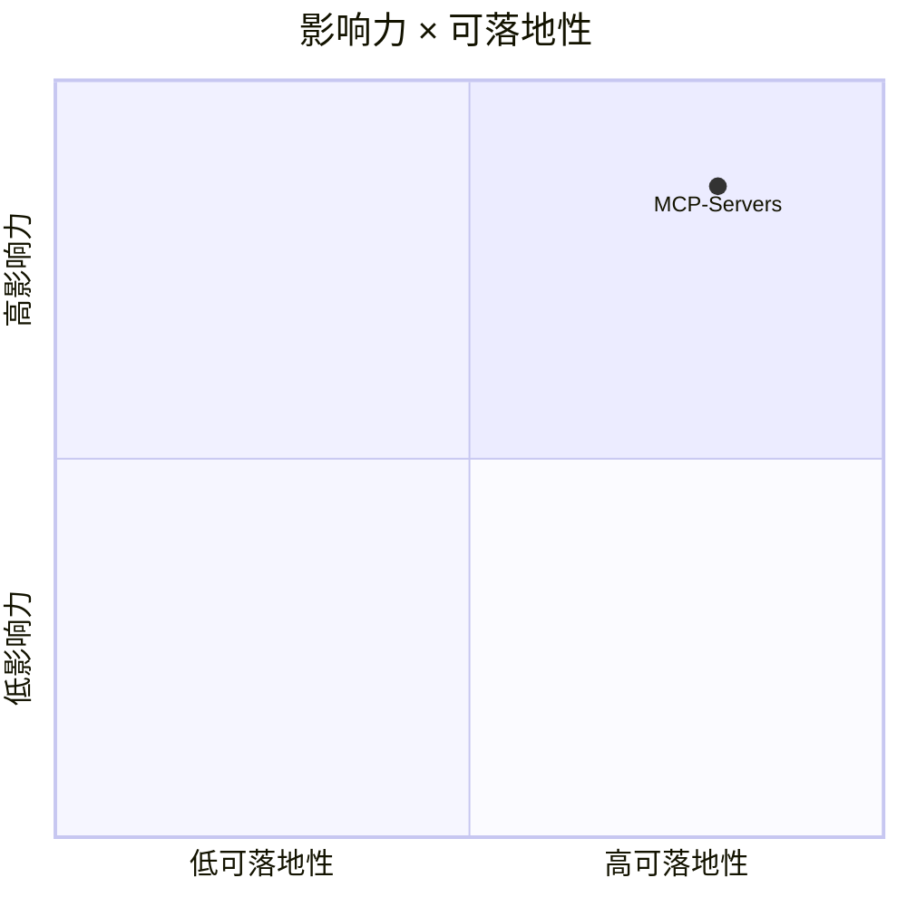

# modelcontextprotocol/servers

> 类型：GitHub 项目
> 创建日期：2026-08-26
> 原文链接：https://github.com/modelcontextprotocol/servers
> 返回日报：[[Daily/2026-08-26]]

## 一句话结论

MCP servers 是 agent 工具生态的关键连接层，影响 coding-agent 与外部系统集成。

#ai-radar #mcp #agents
