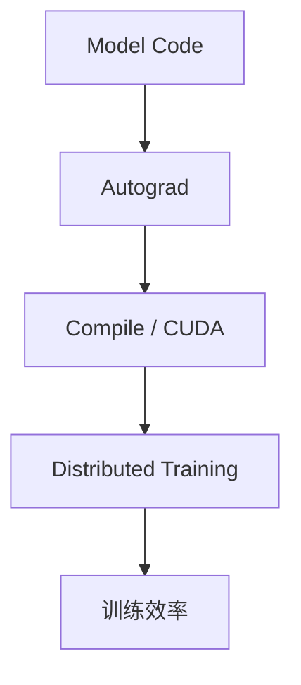
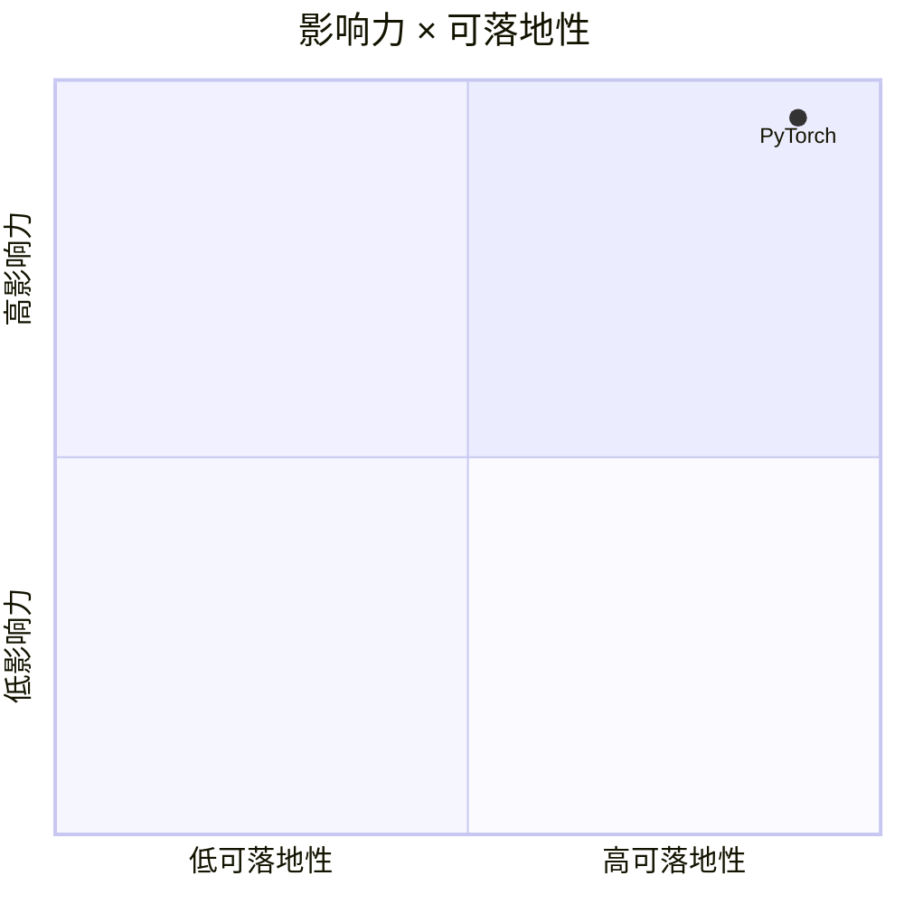

# pytorch/pytorch

> 类型：GitHub 项目
> 创建日期：2026-08-26
> 原文链接：https://github.com/pytorch/pytorch
> 返回日报：[[Daily/2026-08-26]]

## 一句话结论

PyTorch 是训练与推理基础设施的底座项目，适合作为依赖生态健康观察对象。

#ai-radar #pytorch #training
