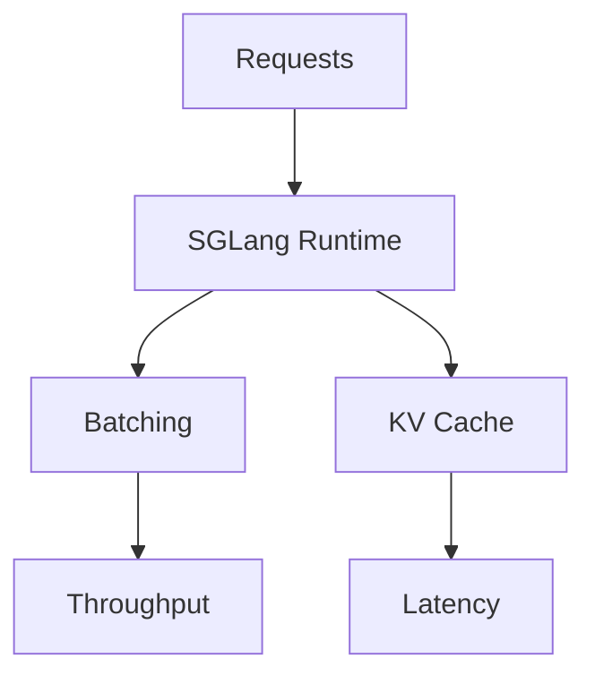
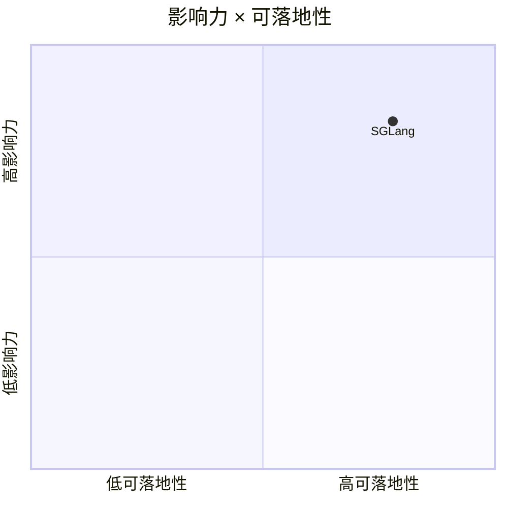

# sgl-project/sglang

> 类型：GitHub 项目
> 创建日期：2026-08-26
> 原文链接：https://github.com/sgl-project/sglang
> 返回日报：[[Daily/2026-08-26]]

## 一句话结论

SGLang 是高性能 LLM/multimodal serving 框架，适合与 vLLM / TensorRT-LLM 对比。

#ai-radar #serving #sglang
