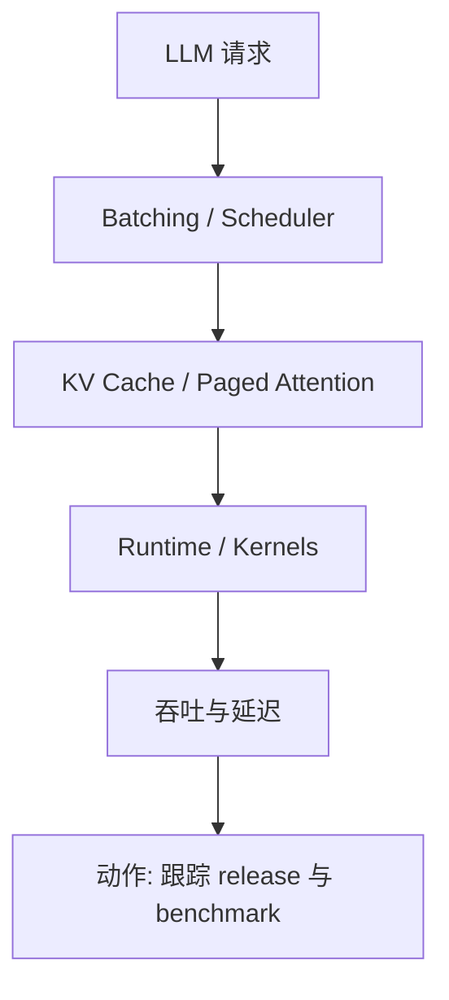
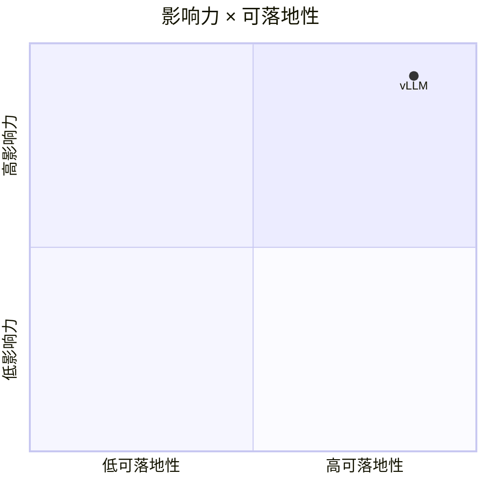

# vllm-project/vllm

> 类型：GitHub 项目
> 创建日期：2026-08-26
> 原文链接：https://github.com/vllm-project/vllm
> 返回日报：[[Daily/2026-08-26]]

## 一句话结论

vLLM 仍是 LLM serving / inference 方向最值得每日跟踪的高 star 项目之一。

## 信息压缩图示

## 对我的影响

- AI Infra：关注 scheduler、KV cache、吞吐、延迟和部署复杂度。
- LLM 工程：适合作为 serving baseline。
- 下一步：查看最新 release、benchmark 和兼容模型列表。

#ai-radar #ai-infra #serving
