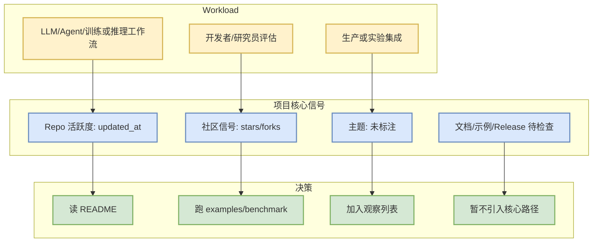

# openai/codex

> 一句话结论：openai/codex 是今日 AI Radar 通过 GitHub API/快照保留的 AI 基础设施项目，当前 stars=118791、forks=18122，需要结合代码活跃度与 benchmark 决定是否试用。

## TL;DR

- 来源：GitHub Repository
- 来源类型：GitHub API / star snapshot / direct watched repo fallback
- Repo：[openai/codex](https://github.com/openai/codex)
- 语言：Rust
- stars / forks：118791 / 18122
- updated_at：2026-08-27T01:04:38Z
- pushed_at：2026-08-27T00:57:45Z
- topics：未标注
- stars_delta：672
- 增长依据：direct watched repo fallback / 非完整全网日增

## 元信息表

| 字段 | 内容 |
|---|---|
| 项目 | openai/codex |
| 描述 | Lightweight coding agent that runs in your terminal |
| 原文 | https://github.com/openai/codex |
| 是否值得试用 | 值得快速试用/跟踪 |
| 可信度 | GitHub API 元数据可信；由于 Search API 403，增长榜为 watched repo / snapshot fallback，非完整全网排名 |

## 信息压缩图示

## 影响矩阵

| 维度 | 判断 | 对我的影响 |
|---|---|---|
| AI Infra / Serving | 中/低 | 可作为 serving/training/agent stack 的候选依赖或对标对象 |
| Agent / Loop | 高 | 关注工具调用、上下文管理、任务循环和权限模式 |
| RL / Game AI | 低 | 可借鉴环境建模、bot 策略或评测基准 |
| 生产风险 | 中 | 需要补查 license、benchmark、release 稳定性和社区 issue |

## 专业解读

Lightweight coding agent that runs in your terminal。对 AI Infra 工程师来说，核心不是 star 数本身，而是它是否暴露了可复用的 runtime、scheduler、agent loop、benchmark 或数据面/控制面设计。今天 GitHub Search API 出现 403，因此本页把该 repo 作为 watched snapshot/fallback 项处理：适合做连续跟踪，不适合宣称为全网今日增长冠军。

## 通俗解释

可以把它当成一个“候选工具/样板工程”：先看它解决什么问题，再看有没有示例、测试和最近维护。如果只是 star 高但没有与当前工作流重合的功能，就只收藏；如果它直接影响推理吞吐、训练效率或 coding-agent loop，就安排试用。

## 关键机制拆解

1. 社区热度：stars=118791，forks=18122。
2. 活跃度：updated_at=2026-08-27T01:04:38Z，pushed_at=2026-08-27T00:57:45Z。
3. 主题相关性：未标注。
4. 下一步验证：README、examples、benchmark、license、open issues。

## 对我的影响

- 若属于 serving/training：优先看吞吐、KV cache、scheduler、kernel、分布式兼容。
- 若属于 coding agent：优先看上下文窗口、权限模式、MCP/工具调用、remote execution、IDE/CLI/TUI。
- 若属于 Rummy/Game AI：优先看规则引擎、仿真环境、bot policy、评测接口。

## 可信度与局限性

- 元数据来自 GitHub API / 本地 snapshot。
- Search API 今日大量 403，Top 10 采用 direct watched repo + previous snapshot fallback，非完整全网排名。
- 未拉取源码做 benchmark，结论是研究与试用优先级，不是生产背书。

## 我应该如何跟进

- 15 分钟：读 README、release、examples。
- 30-60 分钟：本地跑最小 demo 或 benchmark。
- 如果与当前 infra/coding loop/Rummy 业务相关：建立独立 Spike note。

## 相关链接

- 原文：https://github.com/openai/codex
- 今日日报：[[Daily/2026-08-27]]

#ai-radar #github #ai-infra
