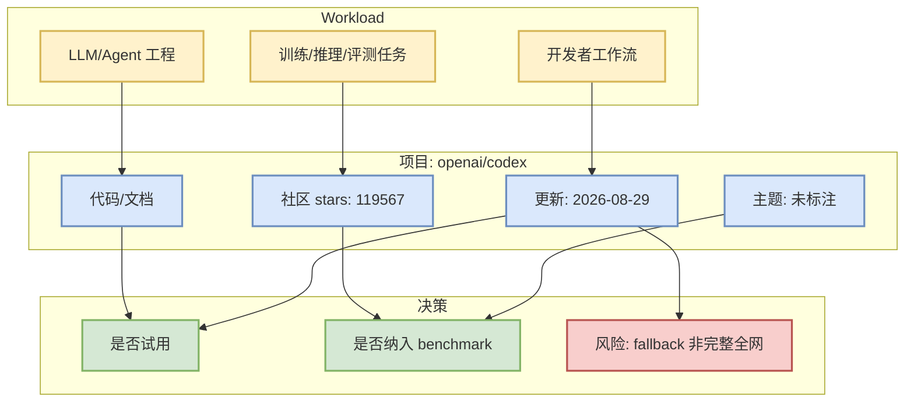

# openai/codex

> 一句话结论：openai/codex 是今日 AI Radar 观察集合中的高信号项目；当前采用 direct watched-repo fallback，增长不代表全 GitHub 排名。

## TL;DR
- Stars：119567；Forks：18254；语言：Rust。
- 描述：Lightweight coding agent that runs in your terminal
- 今日用途：用于判断 AI Infra / coding-agent loop / serving-training 生态的社区热度和试用优先级。

## 元信息
| 字段 | 值 |
|---|---|
| repo | openai/codex |
| 来源类型 | GitHub Repository / direct fallback |
| stars / forks | 119567 / 18254 |
| stars_delta | 776（direct watched repo fallback vs 2026-08-28 snapshot，非完整全网日增） |
| language | Rust |
| updated_at | 2026-08-29T01:03:13Z |
| topics | 未标注 |
| 原文 | https://github.com/openai/codex |

## 信息压缩图示

## 影响矩阵
| 维度 | 判断 |
|---|---|
| AI Infra 价值 | 若项目涉及 serving/training/agent runtime，可进入试用池；否则仅做生态热度参考。 |
| 工程可落地性 | 优先看 README、examples、release 与 issue 活跃度。 |
| 风险 | 今日 GitHub Search 403，榜单为固定观察集合 direct fallback，不是完整全网 Top。 |

## 专业解读
Lightweight coding agent that runs in your terminal。对于 AI Infra 工程，应重点看它是否能减少推理/训练/agent orchestration 中的状态管理、调度或集成成本。

## 通俗解释
把它当作今天观察雷达上的一个候选工具：先看社区规模和更新活跃度，再决定是否安装试用。

## 我应该如何跟进
1. 打开原仓库确认 README/examples/release。
2. 如果涉及 serving 或 coding agent，加入本周试用清单。
3. 明天用新 snapshot 继续观察真实增量。

## 相关链接
- 原文：https://github.com/openai/codex
- 日报：[[Daily/2026-08-29]]

#ai-radar #github #ai-infra #loop-engineering
