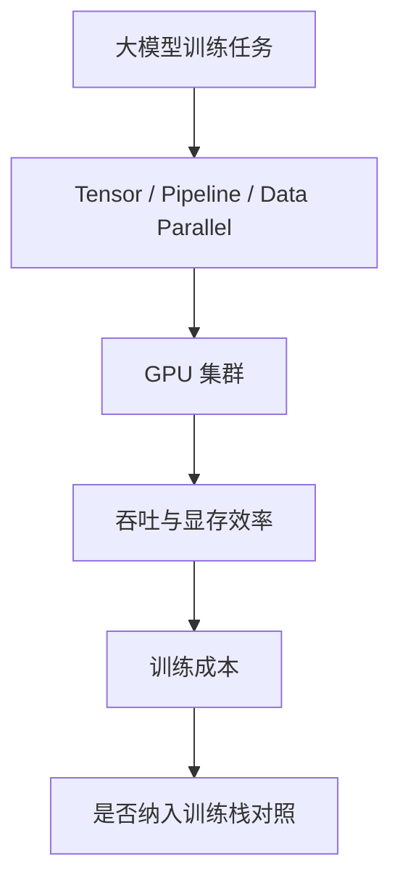

# NVIDIA/Megatron-LM - 2026-08-30

> 一句话结论：Megatron-LM 是分布式大模型训练 fixed watchlist 项目；今日用于补全 direct fallback 增长榜详情页。

## TL;DR
- 来源：GitHub Repository / direct watched repo fallback。
- 主题：distributed training、large-scale transformer training。
- 原文：https://github.com/NVIDIA/Megatron-LM
- 可信度：GitHub direct metadata 可信；增长榜不是完整全网日增。

## 元信息表
| 字段 | 内容 |
|---|---|
| repo | NVIDIA/Megatron-LM |
| 来源类型 | Repository |
| 主题 | Training / Distributed LLM |
| 原文 | https://github.com/NVIDIA/Megatron-LM |

## 信息压缩图示

## 影响矩阵
| 维度 | 判断 | 说明 |
|---|---|---|
| AI Infra | 高 | 大规模训练基线 |
| 可落地性 | 中 | 需要集群环境验证 |
| 风险 | 中 | 版本和硬件耦合较强 |

## 对我的影响
用于对比 DeepSpeed、FSDP、verl 等训练/后训练栈的并行设计。

## 可信度与局限性
今日 GitHub Search 403/rate-limit；本页为 direct fallback 链接补全。

## 相关链接
- Daily：[[Daily/2026-08-30]]
- 原文：https://github.com/NVIDIA/Megatron-LM

#ai-radar #github #training
