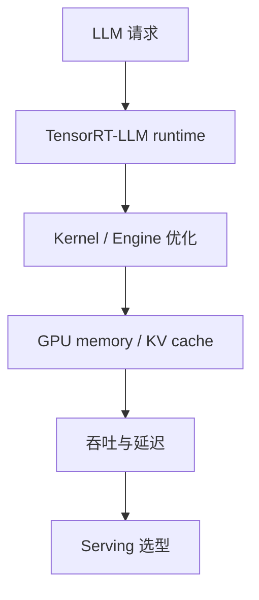

# NVIDIA/TensorRT-LLM - 2026-08-30

> 一句话结论：TensorRT-LLM 是 NVIDIA LLM 推理优化栈 fixed watchlist 项目；今日用于 direct fallback 榜单详情。

## TL;DR
- 来源：GitHub Repository / direct watched repo fallback。
- 主题：LLM inference、TensorRT、GPU kernel、serving optimization。
- 原文：https://github.com/NVIDIA/TensorRT-LLM

## 元信息表
| 字段 | 内容 |
|---|---|
| repo | NVIDIA/TensorRT-LLM |
| 来源类型 | Repository |
| 主题 | Serving / Inference |
| 原文 | https://github.com/NVIDIA/TensorRT-LLM |

## 信息压缩图示

## 影响矩阵
| 维度 | 判断 | 说明 |
|---|---|---|
| Serving | 高 | NVIDIA 推理优化主线 |
| 可落地性 | 中 | 需要硬件与部署适配 |
| 风险 | 中 | 与 CUDA/TensorRT 版本相关 |

## 对我的影响
适合与 vLLM、SGLang 做吞吐/延迟/KV cache/部署复杂度对比。

## 可信度与局限性
今日 broad Search 受限；增长标注为非完整全网日增。

## 相关链接
- Daily：[[Daily/2026-08-30]]
- 原文：https://github.com/NVIDIA/TensorRT-LLM

#ai-radar #github #serving
