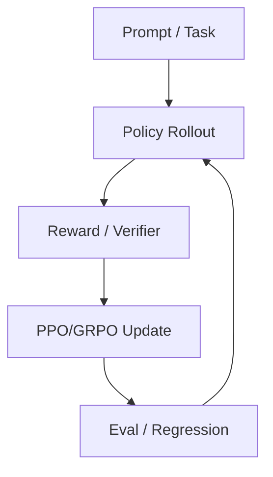

# OpenRLHF/OpenRLHF - 2026-08-30

> 一句话结论：OpenRLHF 是 RLHF / Agentic RL fixed watchlist 项目；适合观察 post-training pipeline 工程化。

## TL;DR
- 来源：GitHub Repository / direct watched repo fallback。
- 主题：RLHF、PPO/GRPO、distributed rollout、post-training。
- 原文：https://github.com/OpenRLHF/OpenRLHF

## 元信息表
| 字段 | 内容 |
|---|---|
| repo | OpenRLHF/OpenRLHF |
| 来源类型 | Repository |
| 主题 | RLHF / Post-training |
| 原文 | https://github.com/OpenRLHF/OpenRLHF |

## 信息压缩图示

## 影响矩阵
| 维度 | 判断 | 说明 |
|---|---|---|
| Post-training | 高 | RLHF 工程化入口 |
| RL Game | 中 | 可迁移 rollout/eval 架构 |
| 风险 | 中 | 需要验证 scale 与稳定性 |

## 对我的影响
可作为 Rummy/Game AI 自博弈环境与 LLM post-training pipeline 的架构参考。

## 可信度与局限性
direct fallback metadata；不是完整全网增长。

## 相关链接
- Daily：[[Daily/2026-08-30]]
- 原文：https://github.com/OpenRLHF/OpenRLHF

#ai-radar #github #rlhf
