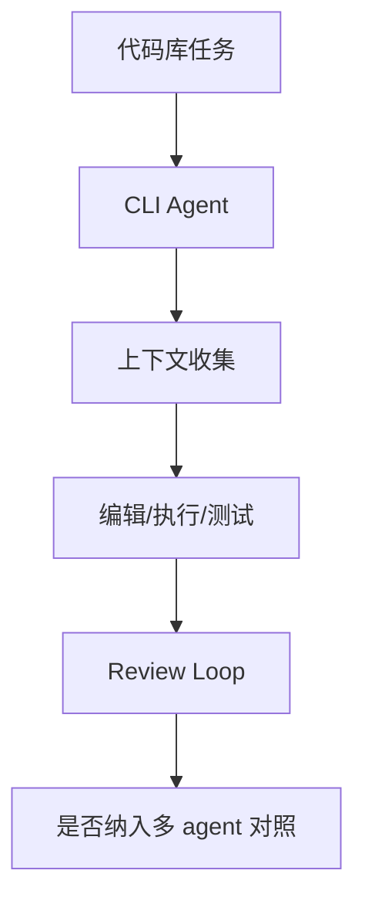

# QwenLM/qwen-code - 2026-08-30

> 一句话结论：Qwen Code 是开源 CLI coding agent fixed watchlist；今日 direct fallback 增长较高，但缺历史 baseline 时需谨慎解读。

## TL;DR
- 来源：GitHub Repository / Releases。
- 主题：coding agent、CLI、AI coding workflow。
- 原文：https://github.com/QwenLM/qwen-code

## 元信息表
| 字段 | 内容 |
|---|---|
| repo | QwenLM/qwen-code |
| 来源类型 | Repository / GitHub Release |
| 工具/厂商 | Qwen / Alibaba |
| 原文 | https://github.com/QwenLM/qwen-code |

## 信息压缩图示

## 影响矩阵
| 维度 | 判断 | 说明 |
|---|---|---|
| Loop Engineering | 高 | 开源 coding agent 对照组 |
| AI coding workflow | 高 | 影响 CLI/TUI 与权限模型比较 |
| 风险 | 中 | 需要查 release 与权限细节 |

## 对我的影响
适合和 Codex、Claude Code、Gemini CLI 比较上下文窗口、MCP、权限、IDE/CLI 工作流。

## 可信度与局限性
今日 broad Search 受限；若 baseline 缺失则增长是冷启动代理，不等同真实日增。

## 相关链接
- Daily：[[Daily/2026-08-30]]
- 原文：https://github.com/QwenLM/qwen-code

#ai-radar #github #coding-agent
