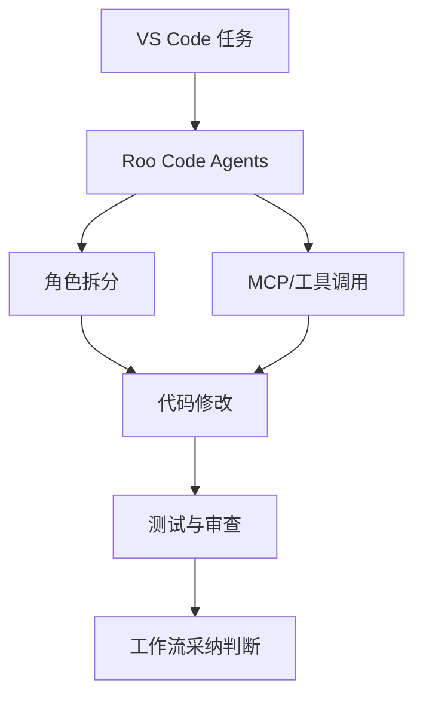

# RooCodeInc/Roo-Code - 2026-08-30

> 一句话结论：Roo Code 是 VS Code 多 agent / AI dev team 形态的重要对照项目。

## TL;DR
- 来源：GitHub Repository / Releases。
- 主题：IDE agent、MCP、multi-agent coding workflow。
- 原文：https://github.com/RooCodeInc/Roo-Code

## 元信息表
| 字段 | 内容 |
|---|---|
| repo | RooCodeInc/Roo-Code |
| 来源类型 | Repository / GitHub Release |
| 工具/厂商 | Roo Code |
| 原文 | https://github.com/RooCodeInc/Roo-Code |

## 信息压缩图示

## 影响矩阵
| 维度 | 判断 | 说明 |
|---|---|---|
| IDE agent | 高 | 多 agent IDE 形态 |
| MCP | 中-高 | 适合观察工具生态接入 |
| 风险 | 中 | 需检查权限边界和执行日志 |

## 对我的影响
可作为 Cline、Continue、Cursor/Windsurf 的对照，用于设计 IDE agent 安全边界。

## 可信度与局限性
今日 broad Search 403；本页是 direct fallback 链接补全。

## 相关链接
- Daily：[[Daily/2026-08-30]]
- 原文：https://github.com/RooCodeInc/Roo-Code

#ai-radar #github #coding-agent
