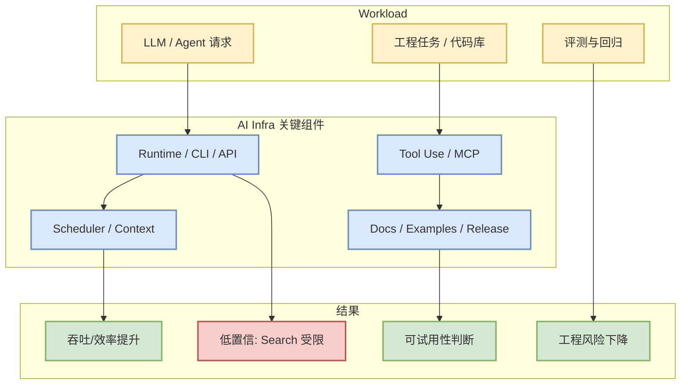

# anthropics/claude-code - 2026-08-30

> 一句话结论：anthropics/claude-code 是今日 AI Infra 固定观察项；在 GitHub Search 受限时使用 direct watched-repo fallback 保持连续追踪。

## TL;DR
- Stars：143397；Forks：22932；语言：Python。
- 增长：93；依据：direct watched repo fallback，非完整全网日增。
- 价值：Claude Code is an agentic coding tool that lives in your terminal, understands your codebase, and helps you code faster by executing routine tasks, explaining c

## 元信息表
| 字段 | 内容 |
|---|---|
| 来源 | GitHub |
| 来源类型 | Repository / direct GET fallback |
| repo | anthropics/claude-code |
| updated_at | 2026-08-30T00:24:33Z |
| topics | 未标注 |
| 原文 | https://github.com/anthropics/claude-code |

## 信息压缩图示

## 影响矩阵
| 维度 | 判断 | 对我的影响 |
|---|---|---|
| AI Infra | 高 | 可作为 serving/training/agent 工程对照组 |
| Loop Engineering | 中 | 观察 agent loop、权限、上下文、工具协议 |
| 生产可用性 | 中 | 需要 README、release、benchmark 与小规模试用验证 |
| 风险 | 中 | 今日 broad Search 受限，增长不是完整全网排名 |

## 专业解读
anthropics/claude-code 的主要信号来自 stars、recent update、topics 与 direct repo metadata。对 AI Infra/LLM 工程而言，不能只看 star，应继续检查 release notes、benchmark、examples 和 issue 质量。

## 通俗解释
这是今天雷达里的一个固定观察项目：它可能不是今天刚发布，但它代表一个方向的主流工程选择或对照样本。

## 关键机制拆解
- 元数据：stars/forks/language/updated_at。
- 工程入口：README、docs、examples、release。
- 决策逻辑：高 star 看生态，增长看新增关注，updated_at 看维护活跃。

## 对我的影响
- 如果是 serving/training 项目：优先看 benchmark、部署复杂度、GPU/KV cache/scheduler 设计。
- 如果是 coding-agent 项目：优先看权限模型、上下文工程、MCP/工具调用、日志和 review loop。

## 可信度与局限性
- GitHub Search 今日 403/rate-limit，广义 Top 10 使用 fixed watched repo direct fallback，标注为非完整全网日增。

## 我应该如何跟进
1. 打开原 repo 查看 README 和 release。
2. 若与当前项目相关，拉取最小 demo 或 benchmark。
3. 记录是否有 docs/examples/benchmark。

## 相关链接
- 原文：https://github.com/anthropics/claude-code
- Daily：[[Daily/2026-08-30]]

#ai-radar #github #ai-infra
