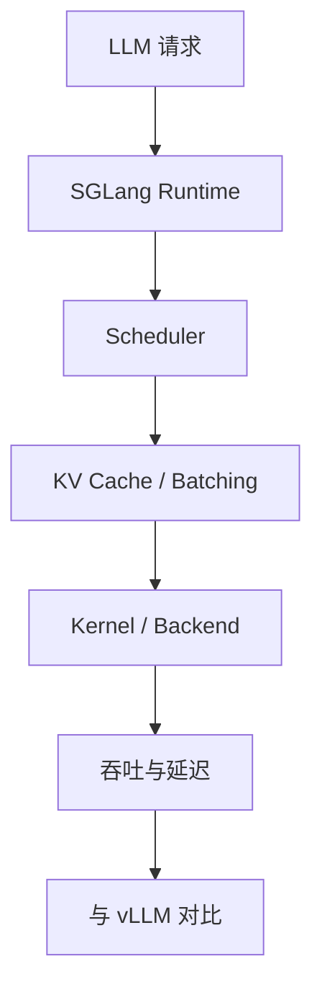

# sgl-project/sglang - 2026-08-30

> 一句话结论：SGLang 是高性能 LLM serving fixed watchlist 项目；今日用于补齐 direct fallback 增长榜详情。

## TL;DR
- 来源：GitHub Repository。
- 主题：LLM serving、runtime、scheduler、KV cache、structured generation。
- 原文：https://github.com/sgl-project/sglang

## 元信息表
| 字段 | 内容 |
|---|---|
| repo | sgl-project/sglang |
| 来源类型 | Repository |
| 主题 | Serving / Inference |
| 原文 | https://github.com/sgl-project/sglang |

## 信息压缩图示

## 影响矩阵
| 维度 | 判断 | 说明 |
|---|---|---|
| Serving | 高 | 与 vLLM 同属核心 serving 路线 |
| 可落地 | 高 | 适合 benchmark 对照 |
| 风险 | 中 | 需验证模型覆盖与部署复杂度 |

## 对我的影响
适合加入 vLLM/TensorRT-LLM 三方 benchmark，检查 scheduler、KV cache、并发吞吐。

## 可信度与局限性
今日 Search 受限；本页使用 direct fallback 元数据。

## 相关链接
- Daily：[[Daily/2026-08-30]]
- 原文：https://github.com/sgl-project/sglang

#ai-radar #github #serving
