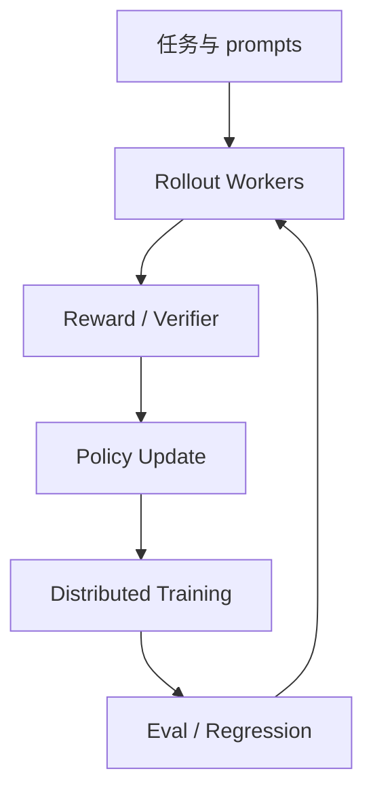

# volcengine/verl - 2026-08-30

> 一句话结论：verl 是后训练/RLHF fixed watchlist 项目，适合观察 GRPO、rollout、分布式训练工程化。

## TL;DR
- 来源：GitHub Repository。
- 主题：RLHF、GRPO、post-training、distributed rollout。
- 原文：https://github.com/volcengine/verl

## 元信息表
| 字段 | 内容 |
|---|---|
| repo | volcengine/verl |
| 来源类型 | Repository |
| 主题 | Post-training / RL |
| 原文 | https://github.com/volcengine/verl |

## 信息压缩图示

## 影响矩阵
| 维度 | 判断 | 说明 |
|---|---|---|
| Post-training | 高 | RLHF/GRPO 工程主线 |
| RL Game | 中 | rollout/eval 可迁移 |
| 风险 | 中 | 需验证资源需求和稳定性 |

## 对我的影响
对 LLM post-training、Game AI self-play、reward design 和 evaluator pipeline 有直接参考价值。

## 可信度与局限性
direct fallback；增长不是完整全网日增。

## 相关链接
- Daily：[[Daily/2026-08-30]]
- 原文：https://github.com/volcengine/verl

#ai-radar #github #post-training
