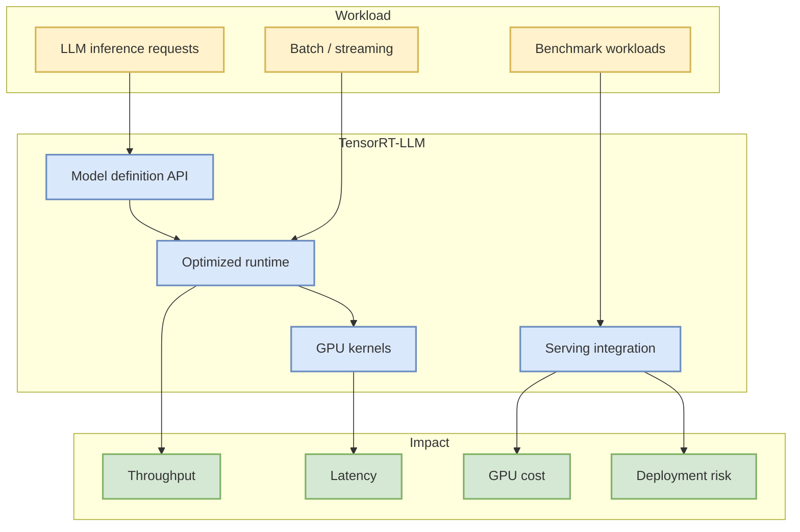

# NVIDIA/TensorRT-LLM

> 一句话结论：TensorRT-LLM 是 NVIDIA 推理优化栈的核心 fixed watchlist 项目，适合持续跟踪 kernel、KV cache、scheduler 与部署接口变化。

## TL;DR
- Repo：[NVIDIA/TensorRT-LLM](https://github.com/NVIDIA/TensorRT-LLM)
- 来源类型：GitHub Repository / direct watched fallback
- 今日状态：GitHub Search 受限，来自 direct watched repo fallback，非完整全网日增。
- 关注点：LLM inference、TensorRT、GPU kernel、serving benchmark。

## 架构/影响图

## 专业解读
对 AI Infra 来说，TensorRT-LLM 的价值在于把模型结构、kernel 优化和 serving runtime 连接起来。后续应重点看 release notes、benchmark、支持模型列表和与 vLLM/SGLang 的吞吐延迟对比。

## 对我的影响
- 用作 NVIDIA GPU serving 优化路线的基准。
- 与 vLLM/SGLang 做部署复杂度和性能对照。
- 今日增长数据为 fallback 口径，不应解读为完整 GitHub 全网排行。

## 相关链接
- 原文：https://github.com/NVIDIA/TensorRT-LLM
- Daily：[[Daily/2026-08-31]]

#ai-radar #github #ai-infra #serving
