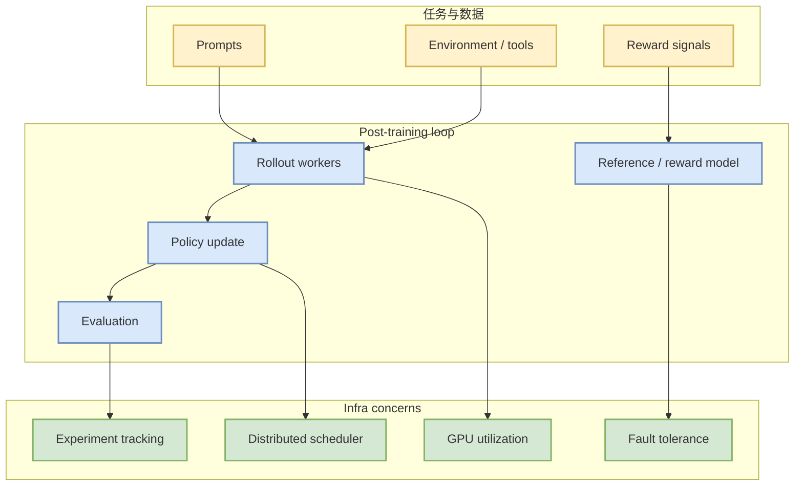

# volcengine/verl

> 一句话结论：verl 是后训练和 RLHF/GRPO rollout 管线的 fixed watchlist 项目，适合跟踪分布式 rollout、reward、PPO/GRPO 与训练效率。

## TL;DR
- Repo：[volcengine/verl](https://github.com/volcengine/verl)
- 来源类型：GitHub Repository / direct watched fallback
- 今日状态：GitHub Search 受限，来自 direct watched repo fallback，非完整全网日增。
- 关注点：post-training、RLHF、GRPO、distributed rollout、reward/eval。

## 机制图

## 专业解读
verl 的重点不是单个算法名，而是把大规模 rollout、reward/eval、policy update 和分布式资源调度组合成可运行的后训练系统。对 RL 游戏模型训练，也可借鉴其 rollout worker 和评测闭环设计。

## 对我的影响
- 可作为 RLHF/GRPO 工程管线参考。
- 可迁移部分 rollout/eval 抽象到 Point Rummy 环境。
- 今日增长数据为 fallback 口径，不应解读为完整 GitHub 全网排行。

## 相关链接
- 原文：https://github.com/volcengine/verl
- Daily：[[Daily/2026-08-31]]

#ai-radar #github #post-training #rlhf
