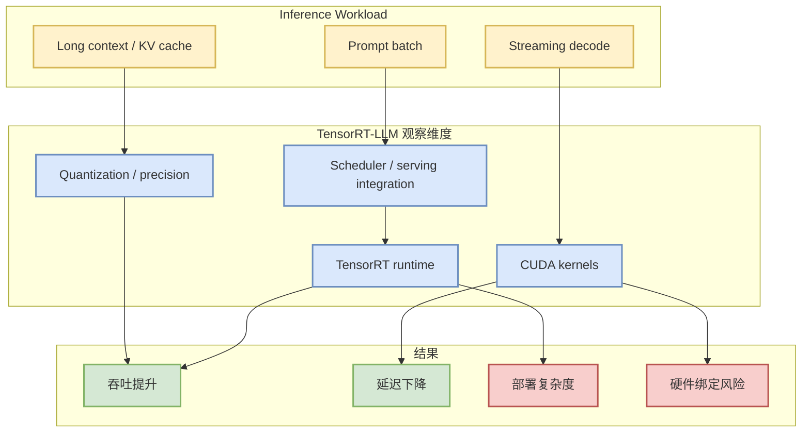

# NVIDIA/TensorRT-LLM

> 日期：2026-09-01  
> 来源类型：GitHub repository / direct watched repo fallback  
> 原文：https://github.com/NVIDIA/TensorRT-LLM

## 一句话结论
TensorRT-LLM 代表 NVIDIA 硬件绑定的 LLM 推理优化路线，适合与 vLLM、SGLang 对比 kernel、量化、KV cache 与部署复杂度。

## TL;DR
- 今日作为 AI Infra / Serving watchlist 补链详情页生成。
- 对用户价值：评估生产 serving 时的吞吐、延迟、GPU 利用率、工程迁移成本。
- 今日增长榜采用 direct watched repo fallback，不代表完整 GitHub 全网日增。

## 元信息表
| 字段 | 内容 |
|---|---|
| repo | `NVIDIA/TensorRT-LLM` |
| 来源类型 | GitHub repository |
| 主题 | LLM serving / inference / kernel / NVIDIA GPU |
| 原文 | https://github.com/NVIDIA/TensorRT-LLM |

## 信息压缩图示

## 专业解读
TensorRT-LLM 的核心价值在低层优化和 NVIDIA 生态集成。它可能在特定 GPU 与模型组合上提供高性能，但也带来构建、版本、部署和框架适配成本。应以统一 benchmark 对比 vLLM/SGLang，而不是只看单项性能数字。

## 通俗解释
它像是 NVIDIA 给 LLM 推理准备的高性能发动机：速度潜力很强，但安装、调校和硬件依赖也更重。

## 关键机制拆解
| 维度 | 观察点 | 我的判断 |
|---|---|---|
| Runtime | TensorRT / CUDA kernel | 高性能潜力 |
| Serving | 与生产 API/调度系统整合 | 需要验证 |
| 风险 | 版本和硬件绑定 | 必须纳入选型成本 |

## 对我的影响
- 做 serving 选型时必须与 vLLM/SGLang 同时 benchmark。
- 适合深挖 GPU kernel、量化和 batch/latency tradeoff。

## 可信度与局限性
- 本页是日报 link-hygiene 补全页；具体 release 变化需后续阅读 release notes。
- 今日 GitHub broad search 受限，增长指标只作固定观察集合。

## 我应该如何跟进
1. 拉取最新 release notes。
2. 用同一模型、prompt length、batch size 对比 vLLM/SGLang。
3. 记录部署脚本、镜像和依赖冲突。

## 相关链接
- 原文：https://github.com/NVIDIA/TensorRT-LLM
- Daily：[[Daily/2026-09-01]]

#ai-radar #github #serving #tensorrt
