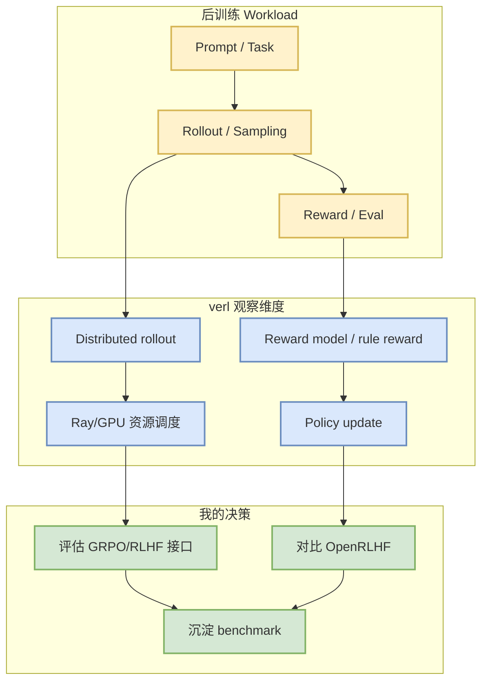

# volcengine/verl

> 日期：2026-09-01  
> 来源类型：GitHub repository / direct watched repo fallback  
> 原文：https://github.com/volcengine/verl

## 一句话结论
verl 是后训练/RLHF/GRPO rollout 与分布式训练固定观察项目，适合跟踪 reward、采样、环境并行与训练执行栈。

## TL;DR
- 今日作为 AI Infra / Post-training watchlist 补链详情页生成。
- 对用户价值：用于设计 RLHF/GRPO rollout pipeline、评估环境接口、训练并行和 benchmark checklist。
- 今日增长榜采用 direct watched repo fallback，不代表完整 GitHub 全网日增。

## 元信息表
| 字段 | 内容 |
|---|---|
| repo | `volcengine/verl` |
| 来源类型 | GitHub repository |
| 主题 | Post-training / RLHF / GRPO / distributed rollout |
| 原文 | https://github.com/volcengine/verl |

## 信息压缩图示

## 专业解读
verl 的价值在于把 LLM 后训练从单机脚本推进到可观测、可并行、可扩展的 rollout/update/eval loop。对 RL 游戏模型和 LLM post-training 都有参考意义：核心是如何组织采样、奖励、策略更新和资源调度。

## 通俗解释
它类似一个“训练流水线框架”：不只是让模型跑起来，而是让采样、打分、更新和多机资源管理形成闭环。

## 关键机制拆解
| 维度 | 观察点 | 我的判断 |
|---|---|---|
| Rollout | 并行采样、环境接口 | 高价值 |
| Reward | rule/reward model 接入 | 适合 Rummy 环境迁移思考 |
| Infra | Ray/GPU 调度、容错 | 需要后续 benchmark |

## 对我的影响
- 可参考其 rollout/eval loop 设计 Rummy bot 训练环境。
- 可与 OpenRLHF、DeepSpeed、Megatron-LM 做训练栈对照。

## 可信度与局限性
- 本页是日报 link-hygiene 补全页；元信息需后续通过 GitHub API/README 深读补充。
- 今日 GitHub broad search 受限，增长指标只作固定观察集合。

## 我应该如何跟进
1. 读 README 和 examples。
2. 抽取 GRPO/RLHF pipeline 图。
3. 与 OpenRLHF 做相同任务 benchmark。

## 相关链接
- 原文：https://github.com/volcengine/verl
- Daily：[[Daily/2026-09-01]]

#ai-radar #github #post-training #rlhf
