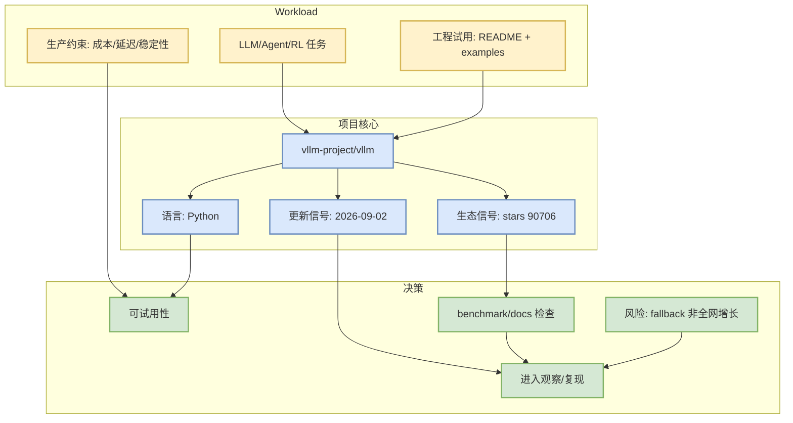

# vllm-project/vllm

> 类型：GitHub 项目
> 大类：GitHub
> 小类：AI Infra / LLM Serving / Training
> 推荐等级：必读
> 创建日期：2026-09-02
> 原文链接：https://github.com/vllm-project/vllm
> 网页详情：https://github.com/dyt27666-oss/AI-news-report-obsidians/blob/main/GitHub/AIInfra/2026-09-02/vllm-project-vllm.md
> 返回日报：[[Daily/2026-09-02]]

## 一句话结论
vllm-project/vllm 是今日 AI Infra / LLM Serving / Training 观察中的代表项目；本页基于 GitHub 元数据与历史 snapshot / direct fallback 做工程判断。

## TL;DR
- **它是什么**：A high-throughput and memory-efficient inference and serving engine for LLMs
- **为什么重要**：它处在 AI Infra / LLM Serving / Training 的工具链/基础设施路径上，可作为 serving、训练、agent loop 或业务原型的参考。
- **和我相关的点**：stars=90706，delta=77，语言=Python，可用于判断生态成熟度与是否值得试用。
- **建议动作**：立即看 README / examples / benchmark

## 元信息
| 字段 | 内容 |
|---|---|
| repo | `vllm-project/vllm` |
| stars / forks | 90706 / 21568 |
| language | Python |
| updated_at | 2026-09-02T01:01:17Z |
| topics | amd, blackwell, cuda, deepseek, deepseek-v3, gpt, gpt-oss, inference, kimi, llama, llm, llm-serving, model-serving, moe, openai, pytorch, qwen, qwen3, tpu, transformer |
| stars_delta | 77 |
| 增长依据 | historical_snapshot / direct watched repo fallback，非完整全网日增 |
| 原文 | [GitHub](https://github.com/vllm-project/vllm) |

## 信息压缩图示

### 辅助结构：试用决策矩阵
| 维度 | 观察 | 建议 |
|---|---|---|
| 成熟度 | stars 90706 / forks 21568 | 高 star 项目优先读 docs，低 star 项目只抽取实现思路 |
| 活跃度 | updated_at 2026-09-02T01:01:17Z | 最近更新可进入 watchlist |
| 相关性 | AI Infra / LLM Serving / Training | 对 AI Infra / coding loop / Rummy 业务分别判断 |
| 风险 | historical_snapshot / direct watched repo fallback，非完整全网日增 | 不把 fallback delta 当作全网真实日增 |

## 专业解读
该项目今日主要作为 **AI Infra / LLM Serving / Training radar 信号**。如果它属于 AI Infra，应重点检查 scheduler、KV cache、runtime、benchmark 和部署文档；如果属于 coding-agent loop，应重点看上下文管理、权限模式、工具调用和 eval loop；如果属于 Rummy，应重点看规则建模、状态表示、bot 策略和仿真接口。

## 通俗解释
把它当成一个候选工具或代码样本：先看是否有人用、是否最近维护、README 是否能跑，再决定是否花时间深读。

## 关键机制拆解
| 机制 | 解决的问题 | 为什么有效 | 可能的坑 |
|---|---|---|---|
| GitHub 生态信号 | 快速筛成熟项目 | stars/forks/更新时间能粗略反映采用度 | star 不等于生产可用 |
| README/examples 检查 | 判断能否落地 | 有 runnable demo 才能低成本试用 | 文档可能滞后 |
| snapshot delta | 识别趋势 | 历史 star 差分比单日热度更稳 | 今日受 rate limit，部分为 direct fallback |

## 对我的影响
| 维度 | 影响 | 建议动作 |
|---|---|---|
| AI Infra | 可作为架构/benchmark 对照 | 检查性能数据和部署复杂度 |
| LLM 工程 | 观察是否影响 serving/training/agent workflow | 看 release notes 与 examples |
| RL / Game AI | 若为 Rummy/Game 项目，可抽取环境建模 | 只复用规则/状态/评测接口 |
| Agent / Eval | 若为 coding loop，可借鉴上下文/工具循环 | 关注权限、日志、评测闭环 |

## 可信度与局限性
- 证据强度：GitHub metadata + 本地 snapshot；今日 GitHub Search 有 403，广义增长榜不是全网完整榜。
- 局限性：未完整阅读源码；benchmark/docs 需要后续人工确认。
- 还需要确认：README 可运行性、license、release 质量。

## 我应该如何跟进
1. 打开 GitHub README，检查安装和示例。
2. 查看 release / issues 中是否有生产阻塞。
3. 对高相关项目加入后续 watchlist。

## 相关链接
- 原文：https://github.com/vllm-project/vllm
- 网页详情：https://github.com/dyt27666-oss/AI-news-report-obsidians/blob/main/GitHub/AIInfra/2026-09-02/vllm-project-vllm.md
- 返回日报：[[Daily/2026-09-02]]

## 标签
#ai-radar #github #ai-infra-llm-serving-training
