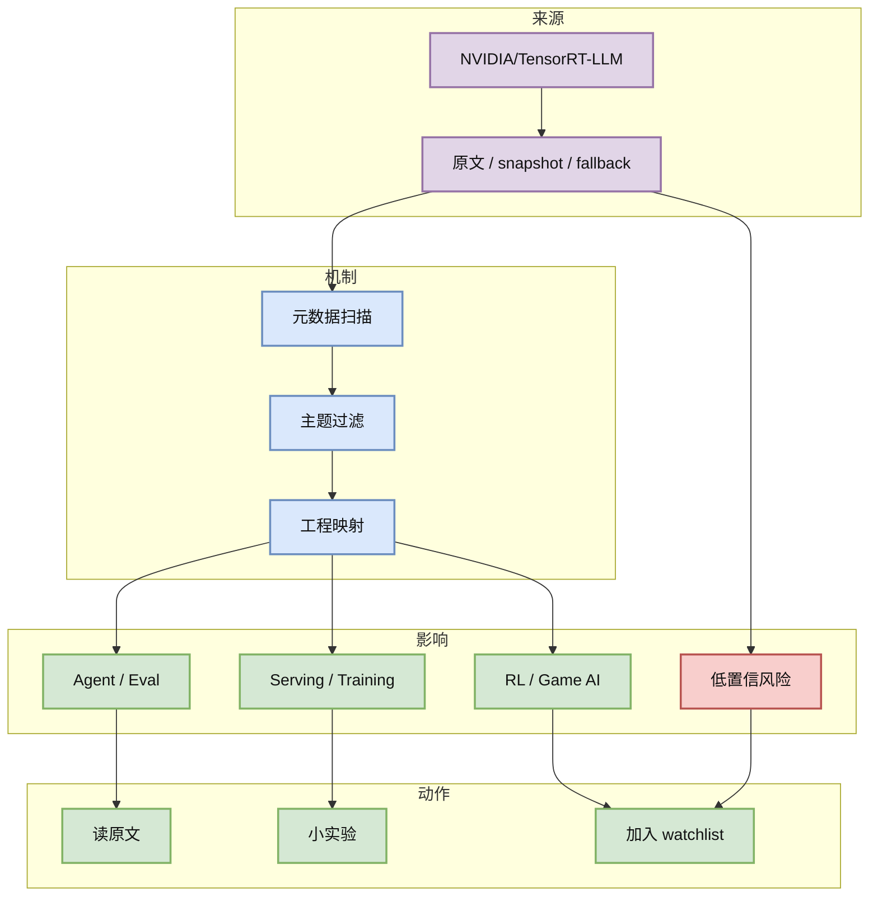

# NVIDIA/TensorRT-LLM

> 类型：GitHub
> 大类：AI Radar 详情
> 小类：GitHub repo / supplemental detail
> 推荐等级：可 skim
> 创建日期：2026-09-03
> 原文链接：https://github.com/NVIDIA/TensorRT-LLM
> 网页详情：https://github.com/dyt27666-oss/AI-news-report-obsidians/blob/main/GitHub/AIInfra/2026-09-03/NVIDIA__TensorRT-LLM.md
> 返回日报：[[Daily/2026-09-03]]

## 一句话结论

NVIDIA GPU 上 LLM inference runtime 和 kernel 优化核心。

## TL;DR

- **它是什么**：今日 AI Radar 的补充详情页，用于补齐 Daily 导航链接。
- **为什么重要**：该条目和 AI Infra、LLM serving、RL post-training、Agent/Eval 或 coding workflow 有直接或间接关系。
- **和我相关的点**：先用于观察和拆机制，不把 fallback 排名当作完整全网事实。
- **建议动作**：打开原文验证 README / release / paper，再决定是否试用。

## 元信息

| 字段 | 内容 |
|---|---|
| 发布方/来源 | NVIDIA/TensorRT-LLM |
| 栏目/来源类型 | GitHub repo / supplemental detail |
| 作者/机构 | 公开来源 / 维护者 |
| 发布时间 | 2026-09-03 自动扫描 |
| 原文 | [原文](https://github.com/NVIDIA/TensorRT-LLM) |
| 代码 | https://github.com/NVIDIA/TensorRT-LLM |
| PDF | 未发现 |
| 标签 | #ai-radar |

## 信息压缩图示

### 辅助结构：使用决策矩阵

| 维度 | 判断 | 下一步 |
|---|---|---|
| 相关性 | AI Infra / LLM / RL / Agent 相关 | 保留观察 |
| 可信度 | 中；来自 snapshot 或 fallback | 二次验证 |
| 可落地性 | 需看 docs/examples/benchmark | 小规模试用 |

## 专业解读

NVIDIA GPU 上 LLM inference runtime 和 kernel 优化核心。 本详情页用于补齐日报里的 Obsidian 导航，避免 Daily 出现断链。由于今日 GitHub Search 403，部分信息来自 direct repo fallback 或前日 snapshot，不能当作完整全网排名。

## 通俗解释

这是一张“候选卡片”：它告诉你这个项目或论文为什么进入今天的雷达，但是否真正采用，需要打开原文再判断。

## 关键机制拆解

| 机制 | 解决的问题 | 为什么有效 | 可能的坑 |
|---|---|---|---|
| snapshot / direct repo | GitHub Search 限流时保持连续性 | 至少保留固定 watchlist 状态 | 不是全网排名 |
| 主题过滤 | 避免泛 ML 噪声 | 只保留 serving/RL/agent 强相关 | 可能漏掉新项目 |
| wikilink 补齐 | 保证 Obsidian 导航可点 | Daily 成为知识库入口 | 详情深度需后续增强 |

## 对我的影响

| 维度 | 影响 | 建议动作 |
|---|---|---|
| AI Infra | 观察 serving/runtime/gateway/control plane | 看原文和 benchmark |
| LLM 工程 | 观察 agent/tool/model 接入 | 加入 watchlist |
| RL / Game AI | 观察训练、环境、reward、evaluator | 抽象接口 |
| Agent / Eval | 观察 loop、memory、permission、skills | 小实验 |

## 可信度与局限性

- 证据强度：中；来自 snapshot 或 fallback
- 局限性：今日 GitHub Search 403，部分数据不是今日全网实时结果。
- 还需要确认：release、benchmark、breaking changes、论文细节。

## 我应该如何跟进

1. 打开原文确认是否有实质更新。
2. 对高相关条目做最小复现实验。
3. 对 fallback 条目只作为观察候选。

## 相关链接

- 原文：https://github.com/NVIDIA/TensorRT-LLM
- 网页详情：https://github.com/dyt27666-oss/AI-news-report-obsidians/blob/main/GitHub/AIInfra/2026-09-03/NVIDIA__TensorRT-LLM.md
- 返回日报：[[Daily/2026-09-03]]

## 标签

#ai-radar #GitHub
