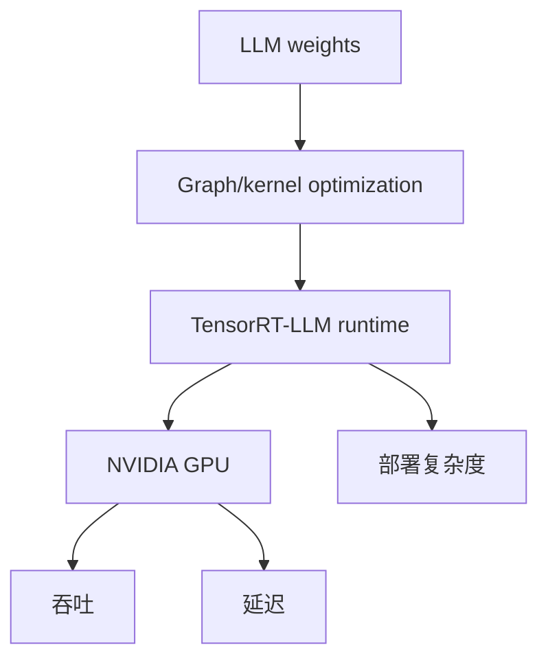

# NVIDIA/TensorRT-LLM

> 日期：2026-09-04
> 来源类型：GitHub direct /repos fallback
> 原文：https://github.com/NVIDIA/TensorRT-LLM

## 一句话结论
TensorRT-LLM 代表 NVIDIA GPU inference runtime 与 kernel 优化方向，直接影响吞吐、延迟和部署成本。

## TL;DR
- 关注 GPU kernel、quantization、runtime integration、multi-GPU serving。
- 与 vLLM/SGLang/KServe 共同构成 serving 栈观察面。

## 信息压缩图示

## 专业解读
对 AI Infra，TensorRT-LLM 的意义在于硬件贴近型推理优化，需要和通用 serving framework 分层比较。

## 相关链接
- 日报：[[Daily/2026-09-04]]
- 原文：https://github.com/NVIDIA/TensorRT-LLM

#ai-radar #nvidia #serving
