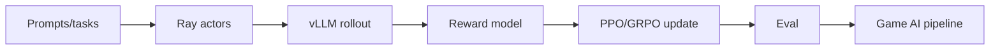

# OpenRLHF/OpenRLHF

> 日期：2026-09-04
> 来源类型：GitHub direct /repos fallback
> 原文：https://github.com/OpenRLHF/OpenRLHF

## 一句话结论
OpenRLHF 是 Ray/vLLM RLHF pipeline 观察点，适合借鉴游戏 RL/self-play 与 LLM post-training 管线。

## TL;DR
- 关注 Ray orchestration、vLLM rollout、reward model、PPO/DPO/GRPO 支持。
- 对用户的 RL game agent 训练，重点是复用管线抽象而非直接复用任务。

## 信息压缩图示

## 专业解读
OpenRLHF 可用于比较 verl/AReno 的分布式设计，提炼 rollout、reward、trainer 的接口边界。

## 相关链接
- 日报：[[Daily/2026-09-04]]
- 原文：https://github.com/OpenRLHF/OpenRLHF

#ai-radar #rlhf #ray
