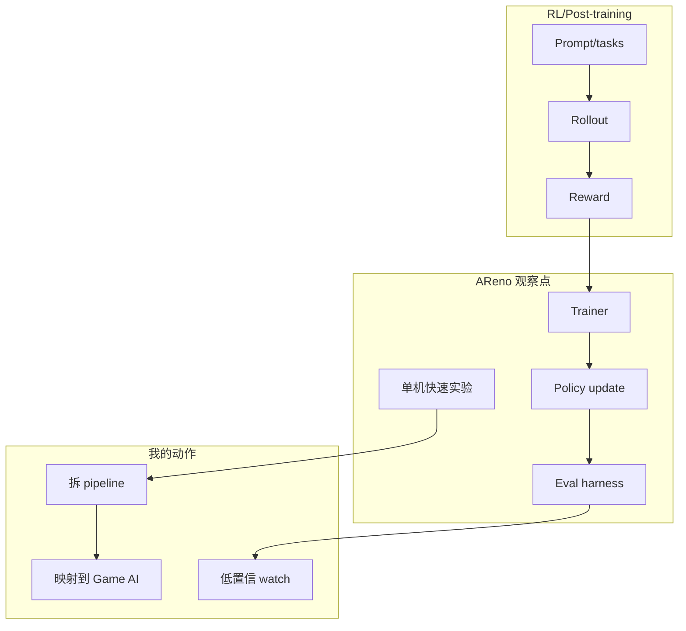

# inclusionAI/AReno

> 日期：2026-09-04
> 来源类型：GitHub direct /repos fallback
> 原文：https://github.com/inclusionAI/AReno

## 一句话结论
AReno 是单机 RL post-training toolkit，适合拆 GRPO/PPO rollout、reward 与 trainer 流程。

## TL;DR
- 今日用于补齐 AI Radar 日报详情页。
- 价值：把 LLM post-training 的 rollout、reward、trainer 抽象迁移到 RL 游戏模型训练。
- 局限：今日 GitHub Search 403，排名来自 fixed watched repo fallback。

## 元信息表
| 字段 | 值 |
|---|---|
| repo | `inclusionAI/AReno` |
| 来源类型 | GitHub direct fallback |
| 原文 | https://github.com/inclusionAI/AReno |

## 信息压缩图示

## 专业解读
对用户的 RL 游戏模型训练工作，重点不是直接复用项目，而是学习 rollout worker、reward shaping、trainer/eval 的边界。

## 通俗解释
把它当成一个 RL 后训练流程样板，先拆结构，再判断能不能迁移到 Rummy 或其他游戏环境。

## 相关链接
- 日报：[[Daily/2026-09-04]]
- 原文：https://github.com/inclusionAI/AReno

#ai-radar #github #rl
