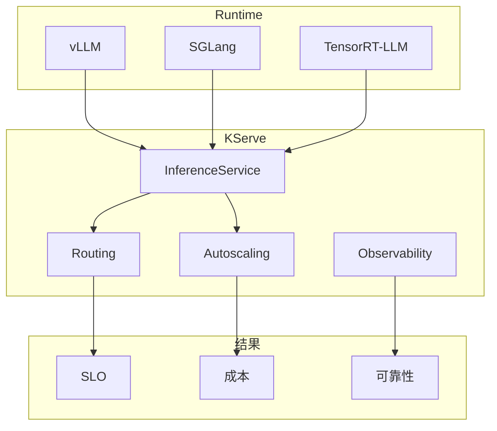

# kserve/kserve

> 日期：2026-09-04
> 来源类型：GitHub direct /repos fallback
> 原文：https://github.com/kserve/kserve

## 一句话结论
KServe 是 K8s 上的 inference control plane，对 GenAI serving 的流量治理、SLO、部署形态有参考意义。

## TL;DR
- 关注 control plane、autoscaling、model routing 和观测。
- 与 vLLM/SGLang/TensorRT-LLM 等 runtime 形成上下层关系。
- 今日为 fixed watched repo fallback。

## 信息压缩图示

## 专业解读
对 AI Infra 工程师，KServe 的价值在于把 runtime 能力挂到统一 control plane，而不是替代底层推理引擎。

## 相关链接
- 日报：[[Daily/2026-09-04]]
- 原文：https://github.com/kserve/kserve

#ai-radar #serving #kubernetes
