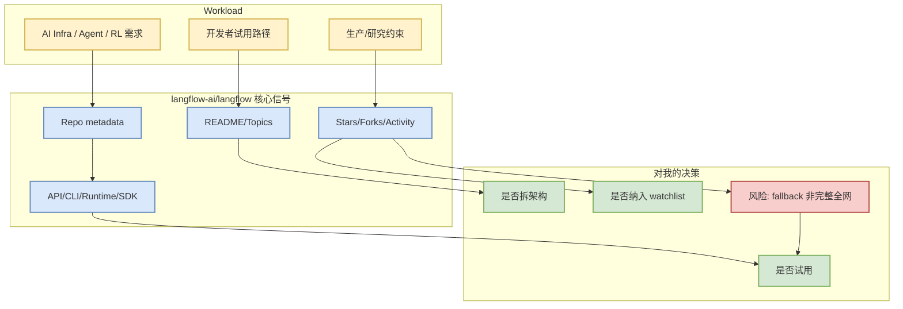

# langflow-ai/langflow

> 日期：2026-09-04
> 来源类型：GitHub direct /repos fallback（今日 Search 403 时使用）
> 原文：https://github.com/langflow-ai/langflow

## 一句话结论
可视化构建和部署 AI agents/workflows，适合观察低代码 agent 平台。

## TL;DR
- stars：154218；forks：10014；language：Python。
- updated_at：2026-09-04T00:10:33Z；growth_basis：direct watched repo fallback vs github-stars-2026-09-03.json，非完整全网日增。
- 对用户价值：从 serving、agent harness、RL post-training 或 coding workflow 的工程视角决定是否试用。

## 元信息表
| 字段 | 值 |
|---|---|
| repo | `langflow-ai/langflow` |
| stars / forks | 154218 / 10014 |
| language | Python |
| topics | agents, chatgpt, generative-ai, large-language-models, multiagent, react-flow |
| updated_at | 2026-09-04T00:10:33Z |
| 原文 | https://github.com/langflow-ai/langflow |

## 信息压缩图示

## 专业解读
可视化构建和部署 AI agents/workflows，适合观察低代码 agent 平台。 今日由于 GitHub Search 403，本页使用 direct `/repos` 元数据维持知识库连续性；它不是全网增长榜，但适合作为固定 watchlist 的真实元数据快照。

## 通俗解释
把它当作今天仍值得盯住的项目卡：先看它解决什么工程问题，再决定是否投入时间读代码或试跑。

## 关键机制拆解
| 维度 | 观察点 |
|---|---|
| Workload | LLM serving、agent loop、RL post-training、coding agent 或数据入口 |
| 工程接口 | CLI/API/SDK/runtime/control plane/docs/examples |
| 风险 | stars_delta 可能来自跨日期 baseline；不代表完整全网日增 |
| 试用门槛 | 先读 README/release，再跑最小 demo |

## 对我的影响
- AI Infra：观察吞吐、调度、模型路由、成本和部署复杂度。
- LLM/Agent：观察 tool-use、memory、MCP、权限、eval loop。
- RL/Game：若涉及训练或仿真，抽象 rollout/reward/evaluator。

## 可信度与局限性
- 元数据来自 GitHub direct repo API。
- 今日 Search API 限流，无法声称这是完整全网排名。

## 我应该如何跟进
1. 打开 README 和 releases。
2. 判断是否有 benchmark/docs/examples。
3. 若与当前工作流重合，建立最小复现实验。

## 相关链接
- 原文：https://github.com/langflow-ai/langflow
- 日报：[[Daily/2026-09-04]]

#ai-radar #github #ai-infra #loop-engineering
