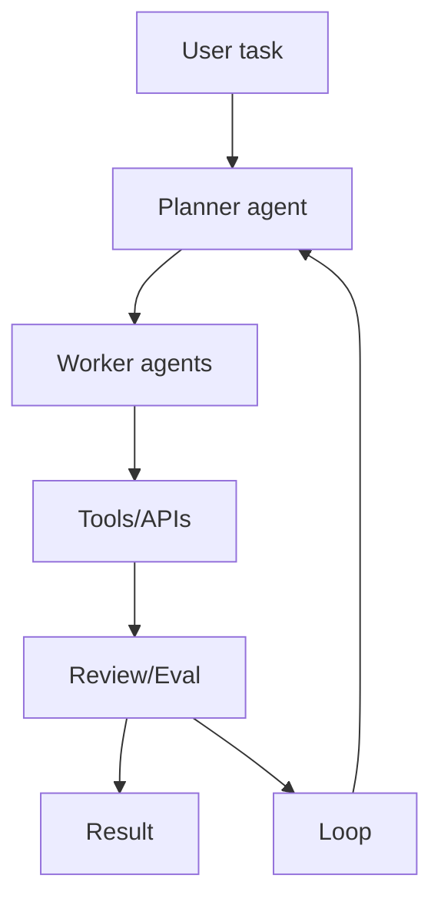

# microsoft/autogen

> 日期：2026-09-04
> 来源类型：GitHub direct /repos fallback
> 原文：https://github.com/microsoft/autogen

## 一句话结论
AutoGen 是 Microsoft 多 agent 编排框架观察点，适合研究企业 agent SDK、对话式协作和 eval loop。

## TL;DR
- 关注多 agent orchestration、工具调用、human-in-the-loop 和企业集成。
- 今日作为公司扫描矩阵 Microsoft 的 repo proxy 详情。

## 信息压缩图示

## 专业解读
AutoGen 的核心价值是多 agent 协作抽象，可与 LangGraph/OpenHands/Hermes Agent 对比 agent loop 的状态管理与评估方式。

## 相关链接
- 日报：[[Daily/2026-09-04]]
- 原文：https://github.com/microsoft/autogen

#ai-radar #microsoft #agent
