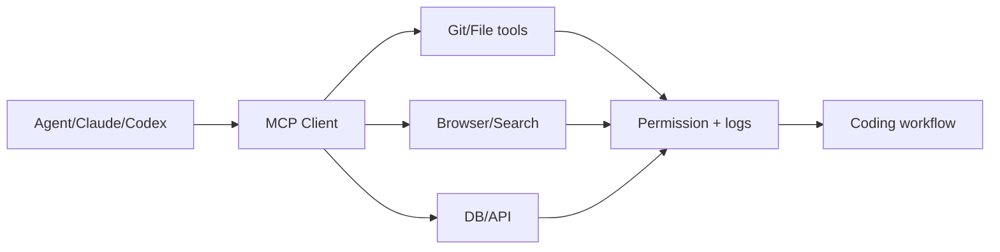

# modelcontextprotocol/servers

> 日期：2026-09-04
> 来源类型：GitHub direct /repos fallback
> 原文：https://github.com/modelcontextprotocol/servers

## 一句话结论
MCP server 生态入口影响 coding agent 工具接入标准化，是 Loop Engineer 和 AI coding workflow 的基础依赖面。

## TL;DR
- MCP 把工具、权限、上下文边界标准化。
- 对多 agent coding、审查、自动化研究抓取都有直接价值。
- 今日 Search 403，本页保留 direct fallback provenance。

## 元信息表
| 字段 | 值 |
|---|---|
| repo | `modelcontextprotocol/servers` |
| 来源类型 | GitHub direct fallback |
| 原文 | https://github.com/modelcontextprotocol/servers |

## 信息压缩图示

## 专业解读
MCP servers 是 agent tool-use 的生态层，决定工具可移植性、权限审计与可观测性。

## 对我的影响
适合纳入 coding-agent harness 的工具接入标准观察。

## 相关链接
- 日报：[[Daily/2026-09-04]]
- 原文：https://github.com/modelcontextprotocol/servers

#ai-radar #mcp #agent
