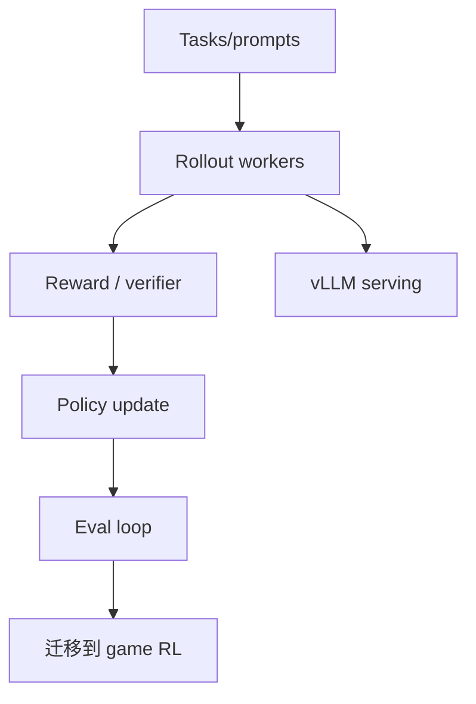

# verl-project/verl

> 日期：2026-09-04
> 来源类型：GitHub direct /repos fallback
> 原文：https://github.com/verl-project/verl

## 一句话结论
verl 是分布式 RL post-training 框架，对 vLLM rollout、reward、trainer 耦合有工程价值。

## TL;DR
- 关注 PPO/GRPO、rollout engine、reward model、trainer orchestration。
- 对 RL 游戏模型训练可迁移为 self-play rollout 与 evaluator 设计参考。

## 信息压缩图示

## 专业解读
verl 的价值在于把 LLM post-training 工程化：分布式采样、奖励、训练和评估闭环可作为游戏 RL pipeline 的参考。

## 相关链接
- 日报：[[Daily/2026-09-04]]
- 原文：https://github.com/verl-project/verl

#ai-radar #rlhf #post-training
