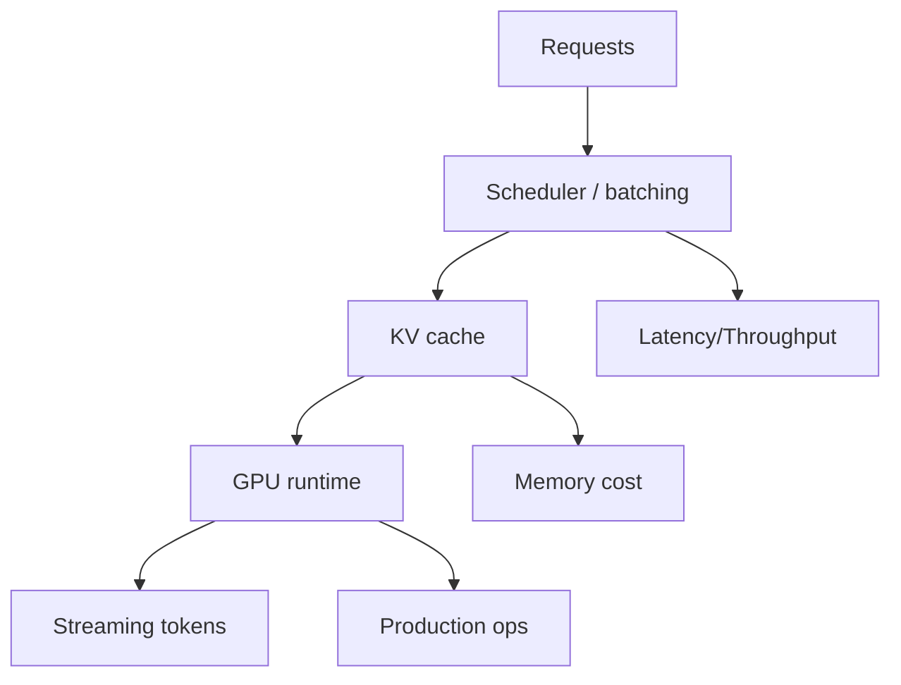

# vllm-project/vllm

> 日期：2026-09-04
> 来源类型：GitHub direct /repos fallback
> 原文：https://github.com/vllm-project/vllm

## 一句话结论
vLLM 仍是高吞吐 LLM serving runtime 的核心观察项目，重点看 scheduler、KV cache、continuous batching 与生产 serving。

## TL;DR
- 用户关注的推理吞吐、延迟、KV cache 和 serving scheduler 都与 vLLM 强相关。
- 今日 GitHub Search 403，本页作为 direct fallback 详情。

## 信息压缩图示

## 专业解读
vLLM 是 serving 基准线项目。每日 watch 的重点应是模型支持、调度策略、分布式推理、量化/并发和与 RL rollout 的耦合方式。

## 相关链接
- 日报：[[Daily/2026-09-04]]
- 原文：https://github.com/vllm-project/vllm

#ai-radar #vllm #serving
