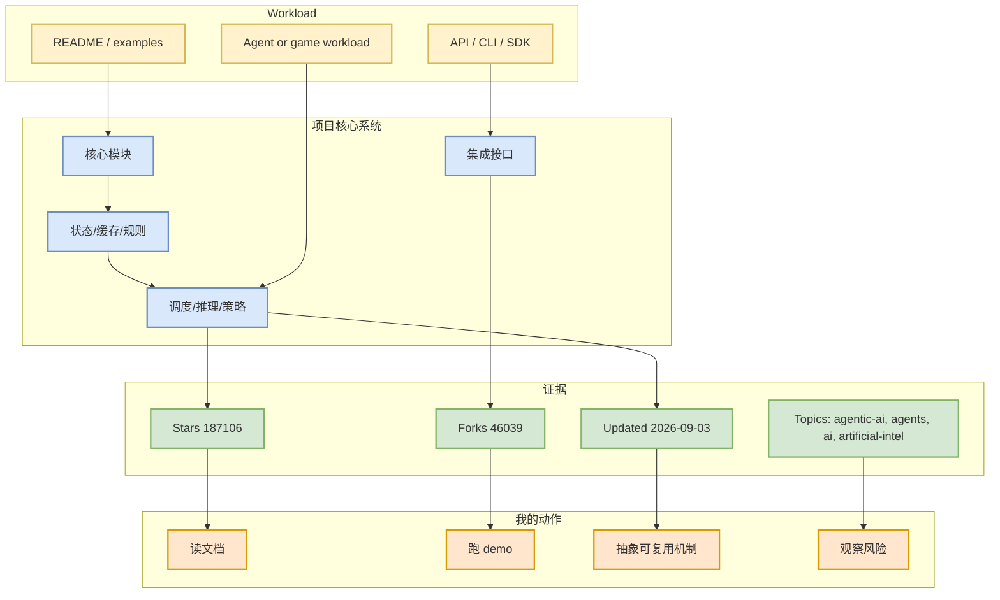
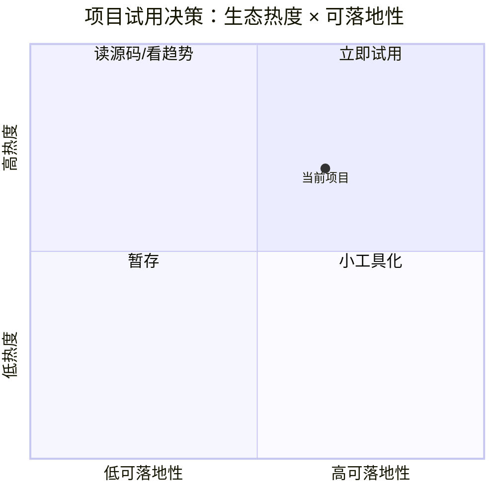

# Significant-Gravitas/AutoGPT

> 类型：GitHub 项目
> 大类：GitHub
> 小类：AI Infra / Agent / Loop / Rummy
> 推荐等级：必读
> 创建日期：2026-09-06
> 原文链接：https://github.com/Significant-Gravitas/AutoGPT
> 网页详情：https://github.com/dyt27666-oss/AI-news-report-obsidians/blob/main/GitHub/AIInfra/2026-09-06/significant-gravitas-autogpt.md
> 返回日报：[[Daily/2026-09-06]]

## 一句话结论
Significant-Gravitas/AutoGPT 当前作为 AI Radar 的 AI Infra / coding-agent workflow 观察项，价值在于把 repo 元数据、增长信号和可试用性集中到一个可回溯页面。

## TL;DR
- **它是什么**：AutoGPT is the vision of accessible AI for everyone, to use and to build on. Our mission is to provide the tools, so that you can focus on what matters.
- **为什么重要**：stars=187106、forks=46039、language=Python，可用于判断生态热度和工程成熟度。
- **和我相关的点**：若涉及 serving/training/agent loop/RL game，可进入试用或源码阅读；若是 rummy 项目，可用于规则、bot、仿真、评测拆解。
- **建议动作**：先读 README/API/examples；若有 benchmark 或 release，再进入本地 spike。

## 元信息
| 字段 | 内容 |
|---|---|
| repo | `Significant-Gravitas/AutoGPT` |
| stars / forks | 187106 / 46039 |
| language | Python |
| updated_at | 2026-09-03T22:01:02Z |
| pushed_at | 2026-09-04T00:36:56Z |
| topics | agentic-ai, agents, ai, artificial-intelligence, autonomous-agents, claude, gpt, llama-api, llm, openai, python |
| stars_delta | 19 |
| 增长依据 | direct watched repo fallback vs github-stars-2026-09-03.json，非完整全网日增 |
| 原文 | [GitHub](https://github.com/Significant-Gravitas/AutoGPT) |

## 信息压缩图示

## 专业解读
该项目的主要判断依据来自 GitHub 元数据与主题匹配：`AutoGPT is the vision of accessible AI for everyone, to use and to build on. Our mission is to provide the tools, so that you can focus on what matters.`。对 AI Infra 项，优先看它是否提供可复现的 serving/training/agent runtime 能力；对 coding-agent 项，优先看 loop、权限、上下文、工具调用和评测闭环；对 Rummy 项，优先看规则引擎、AI opponent、仿真环境、可观测计分和数据结构。

## 通俗解释
把它当成一个候选工具或样例工程：先看项目是否仍在维护，再看代码是否能跑，最后判断里面的机制能否迁移到自己的 AI Infra、agent workflow 或 Point Rummy 业务。

## 关键机制拆解
| 机制 | 解决的问题 | 为什么有效 | 可能的坑 |
|---|---|---|---|
| Repo 元数据扫描 | 快速排序候选 | stars/forks/更新时间给出粗粒度热度 | 不能替代代码质量评估 |
| 主题过滤 | 避免泛 AI 噪声 | 只保留 LLM/Infra/RL/Agent/Rummy | topic/description 可能缺失 |
| 增长对比 | 捕捉新热度 | snapshot delta 比静态 stars 更敏感 | 今日 GitHub Search 403 时需 fallback 标签 |

## 对我的影响
| 维度 | 影响 | 建议动作 |
|---|---|---|
| AI Infra | 可作为架构或工具候选 | 检查 README、benchmark、部署方式 |
| LLM 工程 | 若涉及 agent/LLM，可对照现有 workflow | 关注 API、上下文、工具调用 |
| RL / Game AI | Rummy/游戏项目可抽规则和仿真 | 抽象 state/action/reward/evaluator |
| Agent / Eval | 可作为 loop/harness 参考 | 看是否有 eval、logs、permission model |

## 可信度与局限性
- 证据强度：中等；GitHub 元数据已落盘，但今日 Search 多次 403，部分 broad/loop 结果可能来自历史/direct fallback。
- 局限性：未执行本地 clone/测试。
- 还需要确认：README、license、release、CI、benchmark。

## 我应该如何跟进
1. 打开原文，确认是否有活跃 README/examples。
2. 若与当前工作流强相关，安排 30 分钟 spike。
3. 将可复用机制沉淀到 Concepts 或项目内部 checklist。

## 相关链接
- 原文：https://github.com/Significant-Gravitas/AutoGPT
- 网页详情：https://github.com/dyt27666-oss/AI-news-report-obsidians/blob/main/GitHub/AIInfra/2026-09-06/significant-gravitas-autogpt.md

## 标签
#ai-radar #github #ai-infra #agent #loop-engineering
