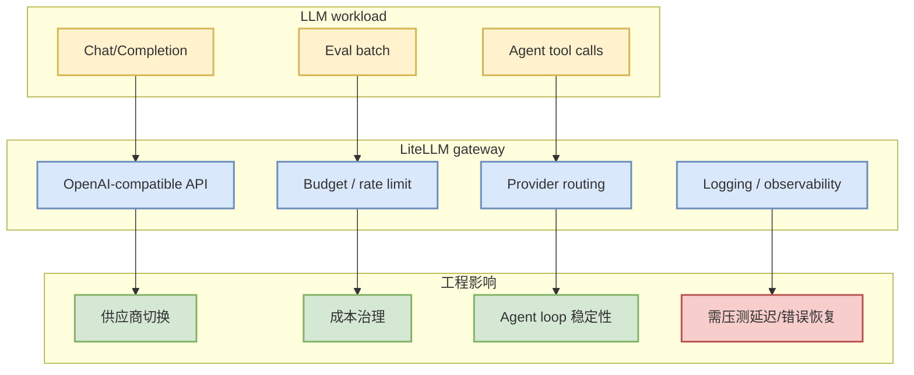

# BerriAI/litellm

> Alias/detail page for AI Infra table. Canonical Loop Engineer note: [[GitHub/LoopEngineer/2026-09-07/berriai-litellm]]

## TL;DR

LiteLLM 是多模型/多厂商调用网关，对 AI Infra 的价值在于统一 API、路由、成本/限流治理；对 Loop Engineer 的价值在于让多 agent 系统在 OpenAI-compatible 接口下切换模型与供应商。

## 信息压缩图示

## 元信息

| 字段 | 内容 |
|---|---|
| repo | BerriAI/litellm |
| 原文 | https://github.com/BerriAI/litellm |
| 日期 | 2026-09-07 |
| 类型 | GitHub / AI Gateway / LLM Infra |

## 后续动作

- 查看 gateway 部署模式、fallback/routing 策略、observability 与限流能力。
- 对多 agent / 多模型 coding workflow 做小流量压测。

#ai-radar #github #ai-infra #llm-gateway
