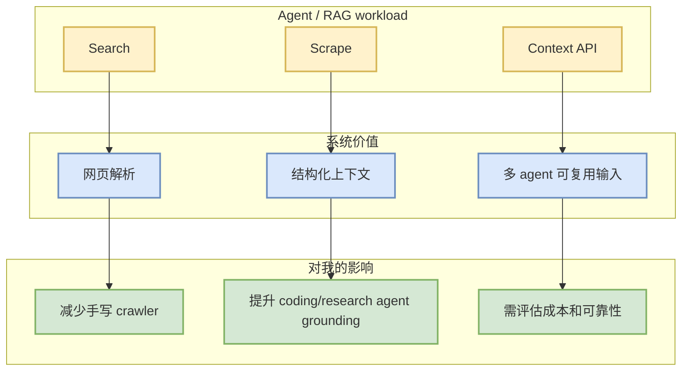

# firecrawl/firecrawl

> Alias/detail page for AI Infra table. Canonical Loop Engineer note: [[GitHub/LoopEngineer/2026-09-07/firecrawl-firecrawl]]

## TL;DR

Firecrawl 是面向 agent/context pipeline 的 web search/scrape/context API。今日同时出现在 AI Infra 与 Loop Engineer 视角：在 AI Infra 侧，它提供数据采集与上下文构建入口；在 Loop Engineer 侧，它影响 coding agent 的 web context 获取。

## 信息压缩图示

## 元信息

| 字段 | 内容 |
|---|---|
| repo | firecrawl/firecrawl |
| 原文 | https://github.com/firecrawl/firecrawl |
| 日期 | 2026-09-07 |
| 类型 | GitHub / AI Infra / Agent context |

## 后续动作

- 打开 README / pricing / deployment docs，确认是否适合内部 research/coding agent。
- 和本地 crawler、browser 工具链对比吞吐、失败率、成本。

#ai-radar #github #ai-infra #agent
