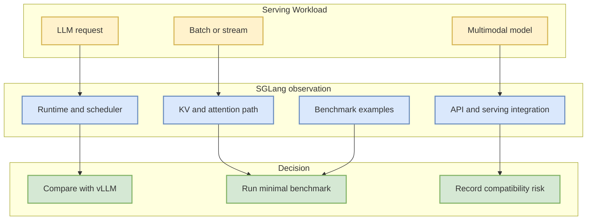

# sgl-project/sglang

> 日期：2026-09-14
> 来源类型：GitHub repository / direct watched repo fallback
> 原文：https://github.com/sgl-project/sglang

## 一句话结论
SGLang 是今日增长榜中的 LLM serving watched repo；增长来自 direct fallback，不代表完整全网日增。

## TL;DR
- Stars：35910；Forks：8826；Language：Python。
- 最近更新：2026-09-14T00:13:54Z；增长依据：cross-snapshot direct watched repo fallback，非完整全网日增。
- 重点：SGLang is a high-performance serving framework for large language models and multimodal models.
- 对我：适合与 vLLM / TensorRT-LLM 一起进入 serving benchmark 观察。

## 元信息表
| 字段 | 值 |
|---|---|
| repo | sgl-project/sglang |
| stars / forks | 35910 / 8826 |
| language | Python |
| topics | attention, blackwell, cuda, deepseek, diffusion, glm, gpt-oss, inference |
| updated_at | 2026-09-14T00:13:54Z |
| 原文 | https://github.com/sgl-project/sglang |

## 信息压缩图示

## 影响矩阵
| 维度 | 判断 | 下一步 |
|---|---|---|
| Serving 价值 | 高：高性能 LLM/VLM serving 框架 | 与 vLLM 做同模型压测 |
| 工程风险 | 中：生态和接口变化需跟踪 | 锁定版本并记录依赖 |
| 今日数据可信度 | 中：repo 元数据 direct 获取，增长非全网 | 明日用 snapshot 校正 |

## 我应该如何跟进
1. 拉 README 与 examples。
2. 选择一个 Qwen/DeepSeek/Kimi 模型做最小 serving benchmark。
3. 对比 vLLM/TensorRT-LLM 的吞吐、延迟、显存与部署复杂度。

#ai-radar #github #aiinfra
