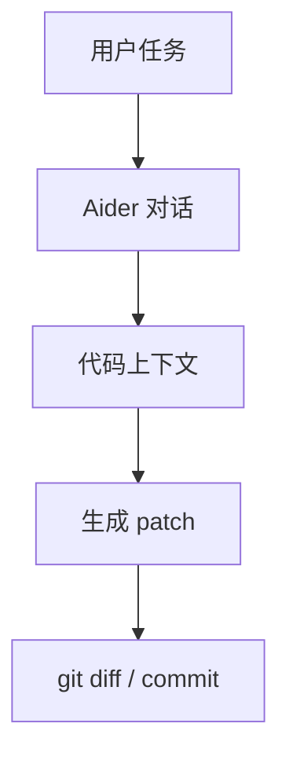

# aider-ai-aider

> 类型：GitHub 详情页
> 创建日期：2026-09-17
> 原文链接：https://github.com/Aider-AI/aider
> 返回日报：[[Daily/2026-09-17]]

## 一句话结论

Aider 是 terminal AI pair programming 工具，适合和 Claude Code、Codex、Cline 等对比 agent loop、diff 应用和 git workflow。

## 信息压缩图示

## 相关链接

- 原文：https://github.com/Aider-AI/aider
