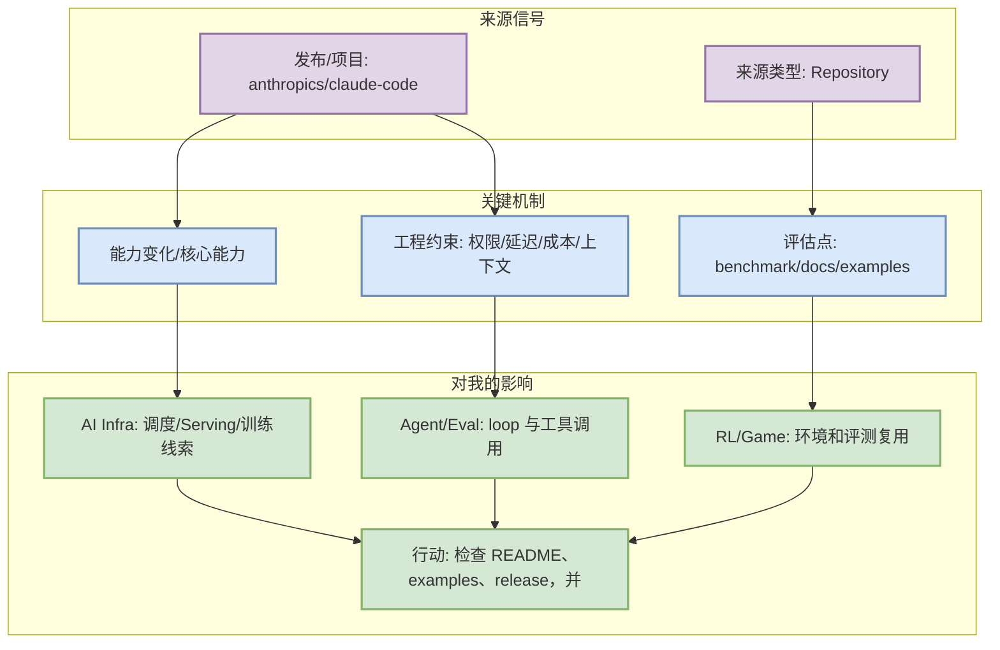
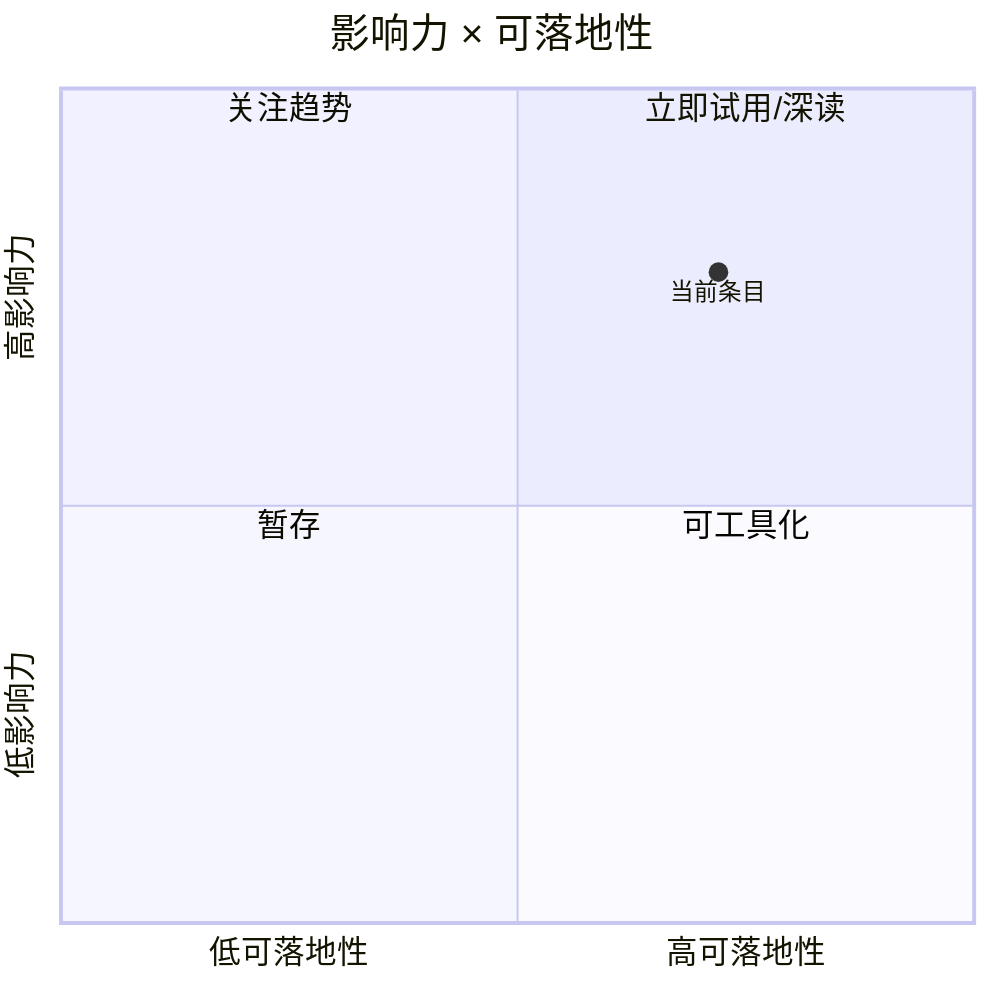

# anthropics/claude-code

> 类型：GitHub 项目
> 大类：GitHub
> 小类：AI Infra / LLM / Agent
> 推荐等级：可 skim
> 创建日期：2026-09-17
> 原文链接：https://github.com/anthropics/claude-code
> 网页详情：https://github.com/dyt27666-oss/AI-news-report-obsidians/blob/main
> 返回日报：[[Daily/2026-09-17]]

## 一句话结论

anthropics/claude-code 是今日 AI Radar GitHub 榜单项目，stars=145508，delta=314。

## TL;DR

- **它是什么**：anthropics/claude-code
- **为什么重要**：它代表 AI Infra/LLM/Agent 工具链中的高关注项目；在 GitHub Search rate limit 下，本条使用 direct watched repo fallback 或 snapshot 数据，适合用于连续观察而不是当作完整全网趋势。
- **和我相关的点**：面向 AI Infra / LLM 工程 / RL 游戏模型训练，可作为工程实现、趋势判断或工具链优化信号。
- **建议动作**：检查 README、examples、release，并与现有 serving/training/agent 工具链做小规模对比。

## 元信息

| 字段 | 内容 |
|---|---|
| 发布方/来源 | GitHub |
| 大厂/实验室 | N/A |
| 栏目/来源类型 | Repository |
| 作者/机构 | GitHub |
| 发布时间 | 2026-09-17 扫描 / 以原文为准 |
| 原文 | [原文](https://github.com/anthropics/claude-code) |
| 代码 | https://github.com/anthropics/claude-code |
| PDF | 未发现 |
| 标签 | #github #ai-infra |

## 信息压缩图示

## 专业解读

它代表 AI Infra/LLM/Agent 工具链中的高关注项目；在 GitHub Search rate limit 下，本条使用 direct watched repo fallback 或 snapshot 数据，适合用于连续观察而不是当作完整全网趋势。 需要重点看它是否提供可复用的 API、benchmark、release note、权限模型或部署路径；如果只是营销公告，则作为低置信趋势观察。

## 通俗解释

可以把它理解成今日雷达里的一个信号：它提示某个工具、项目或研究方向正在变化，但是否投入要看是否能帮助降低工程成本或提高训练/推理/评测效率。

## 关键机制拆解

| 机制 | 解决的问题 | 为什么有效 | 可能的坑 |
|---|---|---|---|
| 来源信号过滤 | 避免噪音 | 只保留 AI Infra/LLM/RL/Agent 强相关 | 访问失败时只能低置信 |
| 工程价值映射 | 把新闻转为行动 | 映射到 serving、agent loop、eval、RL 环境 | 缺 benchmark 时需观察 |
| 后续跟踪 | 保持知识库连续 | GitHub snapshot/原文链接可复查 | API rate limit 影响完整性 |

## 对我的影响

| 维度 | 影响 | 建议动作 |
|---|---|---|
| AI Infra | 关注吞吐、调度、部署和成本信号 | skim 后决定是否试用 |
| LLM 工程 | 关注上下文、工具调用、post-training/eval | 加入候选阅读 |
| RL / Game AI | 关注环境、bot、self-play、评分器 | 仅强相关才复现 |
| Agent / Eval | 关注 coding-agent loop、权限和回放评测 | 可做工具链对比 |

## 可信度与局限性

- 证据强度：中等；原文链接和 GitHub 元数据可验证。
- 局限性：部分来源今日受 rate limit / 访问限制影响。
- 潜在风险：fallback 数据不能当作完整全网排名。
- 还需要确认：release note 细节、benchmark、真实使用反馈。

## 我应该如何跟进

1. 打开原文确认发布时间和功能细节。
2. 若是 GitHub 项目，检查 examples / issues / releases。
3. 若与当前 AI coding 或 Rummy 业务相关，加入小规模 spike。

## 相关链接

- 原文：https://github.com/anthropics/claude-code
- 代码：https://github.com/anthropics/claude-code
- PDF：未发现
- 返回日报：[[Daily/2026-09-17]]

## 标签

#ai-radar #github #ai-infra
