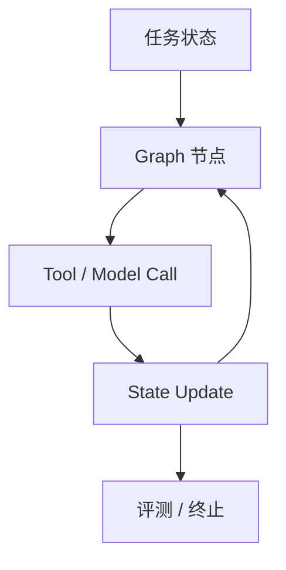
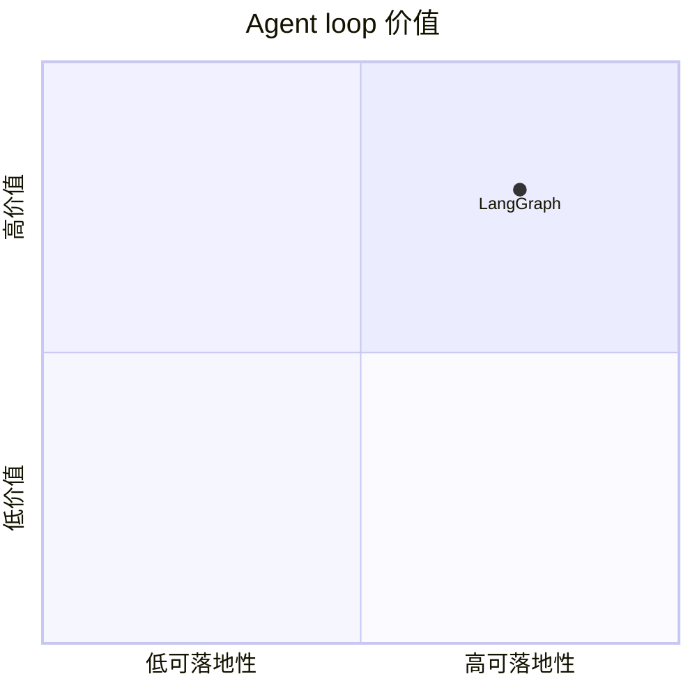

# langchain-ai-langgraph

> 类型：GitHub 详情页
> 创建日期：2026-09-17
> 原文链接：https://github.com/langchain-ai/langgraph
> 返回日报：[[Daily/2026-09-17]]

## 一句话结论

LangGraph 是 resilient agents 的固定观察项目，可用于多步骤 agent、状态机、回放和 eval loop 设计参考。

## 信息压缩图示

## 相关链接

- 原文：https://github.com/langchain-ai/langgraph
