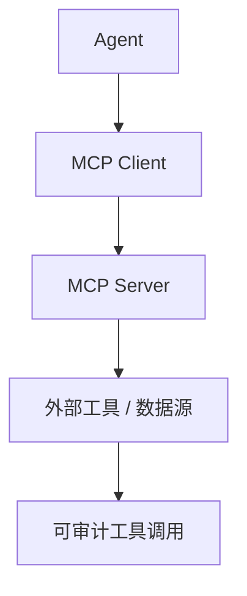
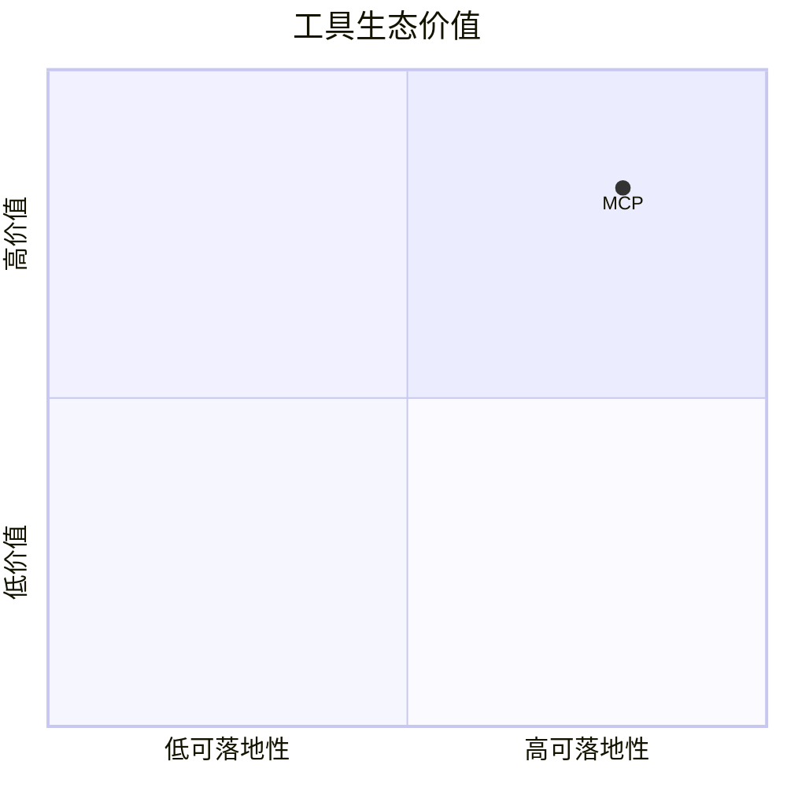

# modelcontextprotocol-servers

> 类型：GitHub 详情页
> 创建日期：2026-09-17
> 原文链接：https://github.com/modelcontextprotocol/servers
> 返回日报：[[Daily/2026-09-17]]

## 一句话结论

MCP servers 是 agent 工具生态的关键基础设施，适合观察工具调用协议、权限边界和 enterprise integration。

## 信息压缩图示

## 对我的影响

- AI coding workflow：影响 Claude Code / Codex / IDE agent 的工具扩展方式。
- Eval：需要为工具调用建立 mock server 和回放评测。

## 相关链接

- 原文：https://github.com/modelcontextprotocol/servers
